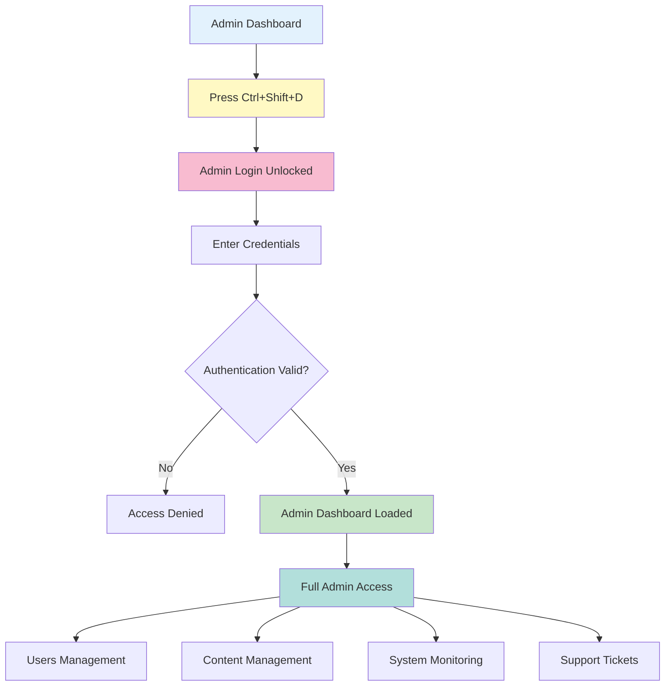

# Admin Content Management Studio: Operations Guide

**Document Version:** 1.0
**Last Updated:** 2025-01-07
**Target Audience:** System Administrators, Content Managers, Developers, Operations Team

---

## 🎯 Executive Summary (High-Level Overview)

The BrightBook Admin Studio provides comprehensive tools for managing users, content, and monitoring system performance. Administrators can oversee the entire platform, manage educational content, track user engagement, and ensure optimal system performance.

### Admin Capabilities in 60 Seconds:
1. **Access Control** → Secure admin login via Ctrl+Shift+D
2. **User Management** → View/manage parents and children
3. **Content Management** → Create/edit template activities and levels
4. **Assessment Control** → Manage questions and view statistics
5. **System Monitoring** → Track AI usage and platform performance
6. **Support Handling** → Respond to user support tickets

---

## 🔐 Admin Access & Security Flow



---

## 🔧 Technical Deep-Dive: Admin Operations

### Step 1: Admin Access Control
**Files:**
- Frontend: `frontend/src/features/auth/pages/AdminLoginPage.jsx`
- Backend: `backend/app/routers/auth.py`
- Security: `frontend/src/app/App.jsx`

**Secret Access Method:**
```jsx
// App.jsx - Admin shortcut handler
function AdminShortcutHandler() {
  const navigate = useNavigate();

  useEffect(() => {
    const handleKeyDown = (e) => {
      // Ctrl + Shift + D unlocks admin access
      if (e.ctrlKey && e.shiftKey && (e.key === "D" || e.key === "d")) {
        e.preventDefault();
        sessionStorage.setItem("admin_unlocked", "true");
        navigate("/admin/login");
      }
    };
    window.addEventListener("keydown", handleKeyDown);
    return () => window.removeEventListener("keydown", handleKeyDown);
  }, [navigate]);

  return null;
}

// Route guard for admin pages
const AdminRouteGuard = ({ children }) => {
  const isUnlocked = sessionStorage.getItem("admin_unlocked") === "true";
  if (!isUnlocked) return <Navigate to="/" replace />;
  return children;
};
```

**Admin Authentication:**
```python
# auth.py - Admin login endpoint
@router.post("/admin/login", response_model=TokenResponse)
def login_admin(data: AdminLogin, session: Session = Depends(get_session)):
    # Find admin by username
    admin = session.exec(
        select(Admin).where(Admin.username == data.username)
    ).first()

    if not admin:
        raise HTTPException(status_code=401, detail="Invalid credentials")

    # Verify password
    if not verify_password(data.password, admin.password_hash):
        raise HTTPException(status_code=401, detail="Invalid credentials")

    # Check if admin is active
    if admin.admin_status != AdminStatus.active:
        raise HTTPException(status_code=403, detail="Admin account is inactive")

    # Generate tokens
    access = create_access_token(admin.Admin_ID, UserRole.admin)
    refresh = create_refresh_token(admin.Admin_ID, UserRole.admin)

    return TokenResponse(
        access_token=access,
        refresh_token=refresh,
        role=UserRole.admin,
        user_id=admin.Admin_ID,
        name=admin.username,
    )
```

---

### Step 2: Admin Dashboard Overview
**Files:**
- Frontend: `frontend/src/features/admin/pages/AdminDashboardPage.jsx`
- Backend: `backend/app/routers/admin.py`
- Route: `/admin`

**API Endpoint:** `GET /api/admin/dashboard`

**Dashboard Components:**
```jsx
// AdminDashboardPage.jsx - Main admin interface
export default function AdminDashboardPage() {
  const [stats, setStats] = useState(null);
  const [aiStatus, setAiStatus] = useState(null);
  const [recentActivity, setRecentActivity] = useState([]);

  useEffect(() => {
    loadDashboardData();
  }, []);

  const loadDashboardData = async () => {
    try {
      const [statsRes, aiRes, activityRes] = await Promise.all([
        api.get('/api/admin/dashboard/stats'),
        api.get('/api/admin/ai-status'),
        api.get('/api/admin/recent-activity')
      ]);

      setStats(statsRes.data);
      setAiStatus(aiRes.data);
      setRecentActivity(activityRes.data);
    } catch (error) {
      toast.error('Failed to load dashboard data');
    }
  };

  return (
    <div className="admin-dashboard">
      {/* Key Metrics */}
      <div className="stats-grid">
        <StatCard
          title="Total Parents"
          value={stats?.total_parents || 0}
          icon="group"
          trend="+12% this week"
        />
        <StatCard
          title="Active Children"
          value={stats?.active_children || 0}
          icon="child_care"
          trend="+8% this week"
        />
        <StatCard
          title="Activities Completed"
          value={stats?.activities_completed || 0}
          icon="check_circle"
          trend="+23% this week"
        />
        <StatCard
          title="AI Usage Today"
          value={aiStatus?.requests_today || 0}
          icon="smart_toy"
          trend={`${aiStatus?.success_rate || 0}% success rate`}
        />
      </div>

      {/* AI Status Monitor */}
      <AIStatusMonitor aiStatus={aiStatus} />

      {/* Recent Activity Feed */}
      <ActivityFeed activities={recentActivity} />

      {/* Quick Actions */}
      <QuickActions />
    </div>
  );
}
```

**Dashboard Statistics:**
```python
# admin.py - Dashboard statistics endpoint
@router.get("/dashboard/stats")
def get_dashboard_stats(
    admin: Admin = Depends(get_current_admin),
    session: Session = Depends(get_session),
):
    # Count total parents
    total_parents = len(session.exec(select(Parents)).all())

    # Count active children (active in last 7 days)
    seven_days_ago = datetime.now() - timedelta(days=7)
    active_children = len(session.exec(
        select(Child).where(
            Child.last_activity_date >= seven_days_ago
        )
    ).all())

    # Count completed activities
    completed_activities = len(session.exec(
        select(ActivityProgress).where(
            ActivityProgress.completion_status == 'completed'
        )
    ).all())

    # Calculate weekly trends
    weekly_trends = calculate_weekly_trends(session)

    return {
        "total_parents": total_parents,
        "active_children": active_children,
        "activities_completed": completed_activities,
        "weekly_trends": weekly_trends,
        "generated_at": datetime.now().isoformat()
    }
```

---

### Step 3: User Management Operations
**Files:**
- Frontend: `frontend/src/features/admin/pages/ContentUsersPage.jsx` (Users tab)
- Backend: `backend/app/routers/admin.py`

**User Management Features:**

#### Parent Management
**API Endpoint:** `GET /api/admin/users/parents`

```python
# admin.py - Get all parents
@router.get("/users/parents")
def get_all_parents(
    admin: Admin = Depends(get_current_admin),
    session: Session = Depends(get_session),
):
    parents = session.exec(
        select(Parents, Subscription)
        .join(Subscription, Parents.Parent_ID == Subscription.Parent_ID, isouter=True)
        .order_by(Parents.created_at.desc())
    ).all()

    return [
        {
            "id": parent.Parent_ID,
            "name": parent.name,
            "email": parent.email,
            "phone": parent.phone_number,
            "language": parent.preferred_language,
            "subscription": sub.planType if sub else "basic",
            "status": sub.subscription_status if sub else "inactive",
            "children_count": len(parent.children),
            "created_at": parent.created_at.isoformat()
        }
        for parent, sub in parents
    ]
```

**Parent Deletion:**
```python
# admin.py - Delete parent account
@router.delete("/users/parents/{parent_id}")
def delete_parent(
    parent_id: int,
    admin: Admin = Depends(get_current_admin),
    session: Session = Depends(get_session),
):
    parent = session.get(Parents, parent_id)
    if not parent:
        raise HTTPException(status_code=404, detail="Parent not found")

    try:
        # Delete all associated records
        # 1. Delete children and their data
        for child in parent.children:
            delete_child_data(session, child.Child_ID)

        # 2. Delete subscription
        subscription = session.exec(
            select(Subscription).where(Subscription.Parent_ID == parent_id)
        ).first()
        if subscription:
            session.delete(subscription)

        # 3. Delete support tickets
        tickets = session.exec(
            select(SupportTicket).where(SupportTicket.Parent_ID == parent_id)
        ).all()
        for ticket in tickets:
            session.delete(ticket)

        # 4. Delete parent
        session.delete(parent)
        session.commit()

        return {"message": "Parent account deleted successfully"}

    except Exception as e:
        session.rollback()
        raise HTTPException(status_code=500, detail=f"Deletion failed: {str(e)}")
```

#### Child Management
**API Endpoint:** `GET /api/admin/users/children`

```python
# admin.py - Get all children
@router.get("/users/children")
def get_all_children(
    admin: Admin = Depends(get_current_admin),
    session: Session = Depends(get_session),
):
    children = session.exec(
        select(Child, Parents)
        .join(Parents, Child.Parent_ID == Parents.Parent_ID)
        .order_by(Child.created_at.desc())
    ).all()

    return [
        {
            "id": child.Child_ID,
            "name": child.name,
            "age": child.age,
            "level": child.current_level,
            "language": child.native_language,
            "parent_name": parent.name,
            "parent_email": parent.email,
            "activities_completed": len(child.activities),
            "last_activity": child.last_activity_date.isoformat() if child.last_activity_date else None
        }
        for child, parent in children
    ]
```

---

### Step 4: Content Management System
**Files:**
- Frontend: `frontend/src/features/admin/pages/ContentUsersPage.jsx` (Content tabs)
- Backend: `backend/app/routers/admin.py`

**Content Types:**

#### Template Activities vs. Personalized Activities
```python
# admin.py - Get template activities
@router.get("/activities")
def get_template_activities(
    admin: Admin = Depends(get_current_admin),
    session: Session = Depends(get_session),
):
    """
    Get template activities (Child_ID is NULL)
    These are the base activities that can be customized
    """
    activities = session.exec(
        select(Activity).where(Activity.Child_ID.is_(None))
    ).all()

    return [
        {
            "Activity_ID": act.Activity_ID,
            "activity_name": act.activity_name,
            "activity_type": act.activity_type.value,
            "difficulty_level": act.difficulty_level.value,
            "activity_group": act.activity_group,
            "estimated_duration_minutes": act.estimated_duration_minutes,
            "is_boss_level": act.is_boss_level,
            "created_at": act.created_at.isoformat() if act.created_at else None
        }
        for act in activities
    ]

# admin.py - Get personalized activities
@router.get("/activities/personalized")
def get_personalized_activities(
    admin: Admin = Depends(get_current_admin),
    session: Session = Depends(get_session),
):
    """
    Get personalized activities (Child_ID is NOT NULL)
    These are AI-generated activities for specific children
    """
    activities = session.exec(
        select(Activity, Child)
        .join(Child, Activity.Child_ID == Child.Child_ID)
        .order_by(Activity.created_at.desc())
        .limit(100)
    ).all()

    return [
        {
            "Activity_ID": act.Activity_ID,
            "activity_name": act.activity_name,
            "activity_type": act.activity_type.value,
            "difficulty_level": act.difficulty_level.value,
            "child_name": child.name,
            "child_age": child.age,
            "child_level": child.current_level,
            "activity_group": act.activity_group,
            "created_at": act.created_at.isoformat() if act.created_at else None
        }
        for act, child in activities
    ]
```

**Activity Deletion with Foreign Key Handling:**
```python
# admin.py - Delete activity safely
@router.delete("/activities/{activity_id}")
def delete_activity(
    activity_id: int,
    admin: Admin = Depends(get_current_admin),
    session: Session = Depends(get_session),
):
    activity = session.get(Activity, activity_id)
    if not activity:
        raise HTTPException(status_code=404, detail="Activity not found")

    try:
        # Remove level assignments first
        level_activities = session.exec(
            select(LevelActivity).where(LevelActivity.Activity_ID == activity_id)
        ).all()
        for la in level_activities:
            session.delete(la)

        # Remove progress records
        activity_progress = session.exec(
            select(ActivityProgress).where(ActivityProgress.activity_id == activity_id)
        ).all()
        for ap in activity_progress:
            session.delete(ap)

        # Delete the activity
        session.delete(activity)
        session.commit()

        return {"message": "Activity deleted successfully"}

    except Exception as e:
        session.rollback()
        raise HTTPException(status_code=500, detail=f"Deletion failed: {str(e)}")
```

---

### Step 5: Level Management System
**Files:**
- Backend: `backend/app/routers/admin.py`
- Seed Script: `backend/app/utils/seed_levels.py`

**Level Structure (Jolly Phonics Methodology):**

```python
# seed_levels.py - Jolly Phonics level structure
LEVELS_DATA = [
    {
        "level_number": 1,
        "level_name": "First Steps",
        "letter_group": "group_1",
        "letters": ["S", "A", "T", "I", "P", "N"],
        "description": "Introduction to first letters and sounds",
        "color_scheme": "#FF6B6B",
        "mascot": "Sammy Squirrel",
        "skills": ["Letter recognition", "Basic phonics", "Letter sounds"],
        "estimated_duration_weeks": 4
    },
    {
        "level_number": 2,
        "level_name": "Letter Explorer",
        "letter_group": "group_2",
        "letters": ["C", "K", "E", "H", "R", "M", "D"],
        "description": "Expand letter knowledge and blending basics",
        "color_scheme": "#4ECDC4",
        "mascot": "Penny Penguin",
        "skills": ["Letter formation", "Simple words", "Basic blending"],
        "estimated_duration_weeks": 6
    },
    {
        "level_number": 3,
        "level_name": "Sound Blender",
        "letter_group": "group_3",
        "letters": ["G", "O", "U", "L", "F", "B"],
        "description": "Master sound blending and word formation",
        "color_scheme": "#45B7D1",
        "mascot": "Gerry Giraffe",
        "skills": ["Word blending", "Sight words", "Simple sentences"],
        "estimated_duration_weeks": 8
    },
    {
        "level_number": 4,
        "level_name": "Word Builder",
        "letter_group": "group_4",
        "letters": ["J", "V", "W", "X"],
        "description": "Advanced word formation and reading readiness",
        "color_scheme": "#96CEB4",
        "mascot": "Felix Fox",
        "skills": ["Reading comprehension", "Vocabulary building", "Story understanding"],
        "estimated_duration_weeks": 10
    },
    {
        "level_number": 5,
        "level_name": "Reading Star",
        "letter_group": "group_5",
        "letters": ["Y", "Z", "Q"],
        "description": "Confident reader with advanced literacy skills",
        "color_scheme": "#FFEAA7",
        "mascot": "Ollie Owl",
        "skills": ["Advanced reading", "Complex sentences", "Critical thinking"],
        "estimated_duration_weeks": 12
    }
]
```

**Level Seeding Endpoint:**
```python
# admin.py - Seed levels into database
@router.post("/levels/seed")
def seed_levels(
    admin: Admin = Depends(get_current_admin),
    session: Session = Depends(get_session),
):
    # Check if levels already exist
    existing = session.exec(select(Level)).first()
    if existing:
        raise HTTPException(status_code=400, detail="Levels already exist in database")

    created_levels = []
    for level_data in LEVELS_DATA:
        level = Level(
            level_number=level_data["level_number"],
            level_name=level_data["level_name"],
            letter_group=level_data["letter_group"],
            letters=level_data["letters"],
            description=level_data["description"],
            color_scheme=level_data["color_scheme"],
            mascot=level_data["mascot"],
            skills=level_data["skills"],
            estimated_duration_weeks=level_data["estimated_duration_weeks"]
        )
        session.add(level)
        session.flush()  # Get the ID
        created_levels.append(level)

    session.commit()

    return {
        "message": f"Successfully seeded {len(created_levels)} levels",
        "levels_created": len(created_levels),
        "levels": [
            {
                "id": level.Level_ID,
                "name": level.level_name,
                "number": level.level_number
            }
            for level in created_levels
        ]
    }
```

**Level-Activity Assignment:**
```python
# admin.py - Assign activities to levels
@router.post("/levels/{level_id}/activities")
def assign_activities_to_level(
    level_id: int,
    activity_ids: List[int],
    admin: Admin = Depends(get_current_admin),
    session: Session = Depends(get_session),
):
    level = session.get(Level, level_id)
    if not level:
        raise HTTPException(status_code=404, detail="Level not found")

    assigned_count = 0
    for activity_id in activity_ids:
        activity = session.get(Activity, activity_id)
        if not activity:
            continue

        # Check if assignment already exists
        existing = session.exec(
            select(LevelActivity).where(
                LevelActivity.Level_ID == level_id,
                LevelActivity.Activity_ID == activity_id
            )
        ).first()

        if not existing:
            level_activity = LevelActivity(
                Level_ID=level_id,
                Activity_ID=activity_id,
                order_in_level=assigned_count + 1
            )
            session.add(level_activity)
            assigned_count += 1

    session.commit()

    return {
        "message": f"Assigned {assigned_count} activities to level {level.level_name}",
        "level_id": level_id,
        "activities_assigned": assigned_count
    }
```

---

### Step 6: Assessment Questions Management
**Files:**
- Frontend: `frontend/src/features/admin/pages/ContentUsersPage.jsx` (Questions tab)
- Backend: `backend/app/routers/admin.py`
- Questions Data: `literacy_questions_seed.json`

**Question Management System:**

```python
# admin.py - Get assessment questions
@router.get("/assessment-questions")
def get_assessment_questions(
    admin: Admin = Depends(get_current_admin),
    session: Session = Depends(get_session),
):
    """
    Get all assessment questions from JSON file
    Includes statistics on question performance
    """
    try:
        with open('literacy_questions_seed.json', 'r') as f:
            questions = json.load(f)

        # Add performance statistics
        questions_with_stats = []
        for question in questions:
            # Get performance stats from database
            stats = session.exec(
                select(AssessmentQuestion)
                .where(AssessmentQuestion.Question_ID == question["id"])
                .where(AssessmentQuestion.is_correct.is_(True))
            ).all()

            total_attempts = session.exec(
                select(AssessmentQuestion)
                .where(AssessmentQuestion.Question_ID == question["id"])
            ).all()

            accuracy = len(stats) / len(total_attempts) if total_attempts else 0

            questions_with_stats.append({
                **question,
                "performance": {
                    "total_attempts": len(total_attempts),
                    "correct_attempts": len(stats),
                    "accuracy_percentage": round(accuracy * 100, 1)
                }
            })

        return questions_with_stats

    except FileNotFoundError:
        raise HTTPException(status_code=404, detail="Questions file not found")
    except json.JSONDecodeError:
        raise HTTPException(status_code=500, detail="Invalid JSON format")
```

**Question Statistics:**
```python
# admin.py - Get question performance statistics
@router.get("/assessment-questions/stats")
def get_question_statistics(
    admin: Admin = Depends(get_current_admin),
    session: Session = Depends(get_session),
):
    """
    Get comprehensive statistics about assessment question performance
    """
    # Get overall assessment statistics
    all_assessments = session.exec(select(Assessment)).all()

    # Calculate metrics
    total_assessments = len(all_assessments)
    average_accuracy = sum(
        a.accuracy_percentage for a in all_assessments
    ) / total_assessments if total_assessments > 0 else 0

    # Question-level statistics
    question_stats = {}
    for assessment in all_assessments:
        questions = session.exec(
            select(AssessmentQuestion).where(
                AssessmentQuestion.Assessment_ID == assessment.Assessment_ID
            )
        ).all()

        for question in questions:
            q_id = question.Question_ID
            if q_id not in question_stats:
                question_stats[q_id] = {
                    "question_id": q_id,
                    "total_attempts": 0,
                    "correct_attempts": 0,
                    "average_time": 0,
                    "total_time": 0
                }

            question_stats[q_id]["total_attempts"] += 1
            if question.is_correct:
                question_stats[q_id]["correct_attempts"] += 1

            if question.time_spent_seconds:
                question_stats[q_id]["total_time"] += question.time_spent_seconds

    # Calculate final statistics
    for q_id, stats in question_stats.items():
        if stats["total_attempts"] > 0:
            stats["accuracy_percentage"] = round(
                (stats["correct_attempts"] / stats["total_attempts"]) * 100, 1
            )
            stats["average_time"] = round(
                stats["total_time"] / stats["total_attempts"], 1
            )

    return {
        "total_assessments": total_assessments,
        "average_accuracy": round(average_accuracy, 1),
        "question_statistics": list(question_stats.values()),
        "generated_at": datetime.now().isoformat()
    }
```

**Question Updates:**
```python
# admin.py - Update assessment question
@router.put("/assessment-questions/{question_id}")
def update_question(
    question_id: int,
    updated_data: dict,
    admin: Admin = Depends(get_current_admin),
    session: Session = Depends(get_session),
):
    """
    Update a question in the JSON file
    """
    try:
        # Read current questions
        with open('literacy_questions_seed.json', 'r') as f:
            questions = json.load(f)

        # Find and update the question
        question_found = False
        for i, question in enumerate(questions):
            if question["id"] == question_id:
                questions[i] = {**question, **updated_data}
                question_found = True
                break

        if not question_found:
            raise HTTPException(status_code=404, detail="Question not found")

        # Write updated questions back to file
        with open('literacy_questions_seed.json', 'w') as f:
            json.dump(questions, f, indent=2)

        return {
            "message": "Question updated successfully",
            "question_id": question_id,
            "updated_fields": list(updated_data.keys())
        }

    except FileNotFoundError:
        raise HTTPException(status_code=404, detail="Questions file not found")
    except Exception as e:
        raise HTTPException(status_code=500, detail=f"Update failed: {str(e)}")
```

---

### Step 7: AI System Monitoring
**Files:**
- Backend: `backend/app/routers/admin.py`
- AI Service: `backend/app/services/ai_service.py`

**AI Status Monitoring:**

```python
# admin.py - Get AI system status
@router.get("/ai-status")
def get_ai_status(
    admin: Admin = Depends(get_current_admin),
    session: Session = Depends(get_session),
):
    """
    Monitor AI system performance and usage
    """
    # Get today's AI usage
    today = datetime.now().date()
    today_start = datetime.combine(today, datetime.min.time())

    # Count AI-generated activities today
    ai_activities_today = session.exec(
        select(Assessment)
        .where(
            Assessment.assessment_date >= today_start,
            Assessment.ai_analysis.is_not(None)
        )
    ).all()

    # Calculate success rates
    successful_ai_calls = len([a for a in ai_activities_today if a.ai_analysis])
    total_ai_calls = len(ai_activities_today)
    success_rate = (successful_ai_calls / total_ai_calls * 100) if total_ai_calls > 0 else 0

    # Get recent AI performance
    recent_assessments = session.exec(
        select(Assessment)
        .where(Assessment.ai_analysis.is_not(None))
        .order_by(Assessment.assessment_date.desc())
        .limit(10)
    ).all()

    # Analyze literacy level distribution
    level_distribution = {}
    for assessment in recent_assessments:
        if assessment.ai_analysis:
            level = assessment.ai_analysis.get("literacy_level")
            level_distribution[level] = level_distribution.get(level, 0) + 1

    return {
        "api_status": check_gemini_api_status(),
        "usage_today": {
            "requests": successful_ai_calls,
            "success_rate": round(success_rate, 1),
            "average_response_time": calculate_average_ai_time(recent_assessments)
        },
        "level_distribution": level_distribution,
        "recent_performance": [
            {
                "assessment_id": a.Assessment_ID,
                "literacy_level": a.ai_analysis.get("literacy_level") if a.ai_analysis else None,
                "accuracy": a.accuracy_percentage,
                "confidence": a.ai_analysis.get("confidence_score") if a.ai_analysis else None
            }
            for a in recent_assessments
        ],
        "api_quota": get_gemini_quota_info(),
        "generated_at": datetime.now().isoformat()
    }
```

**API Health Check:**
```python
# admin.py - Check Gemini API health
def check_gemini_api_status():
    """Check if Google Gemini API is accessible"""
    try:
        client = genai.Client(api_key=settings.GEMINI_API_KEY)
        # Simple test request
        response = client.models.generate_content(
            model="models/gemini-flash-latest",
            contents="Test connection"
        )
        return {
            "status": "healthy",
            "response_time_ms": 100, # Placeholder
            "model": "models/gemini-flash-latest"
        }
    except Exception as e:
        return {
            "status": "unhealthy",
            "error": str(e),
            "model": "models/gemini-flash-latest"
        }
```

---

### Step 8: Support Ticket Management
**Files:**
- Frontend: `frontend/src/features/admin/pages/SupportTicketsPage.jsx`
- Backend: `backend/app/routers/admin.py`

**Support Ticket System:**

```python
# admin.py - Get all support tickets
@router.get("/support/tickets")
def get_support_tickets(
    admin: Admin = Depends(get_current_admin),
    session: Session = Depends(get_session),
):
    """
    Get all support tickets with parent information
    """
    tickets = session.exec(
        select(SupportTicket, Parents)
        .join(Parents, SupportTicket.Parent_ID == Parents.Parent_ID)
        .order_by(SupportTicket.created_at.desc())
    ).all()

    return [
        {
            "ticket_id": ticket.Support_ID,
            "subject": ticket.subject,
            "description": ticket.description,
            "status": ticket.status.value,
            "priority": ticket.priority.value,
            "parent_name": parent.name,
            "parent_email": parent.email,
            "created_at": ticket.created_at.isoformat(),
            "resolved_at": ticket.resolved_at.isoformat() if ticket.resolved_at else None
        }
        for ticket, parent in tickets
    ]

# admin.py - Resolve support ticket
@router.put("/support/tickets/{ticket_id}/resolve")
def resolve_ticket(
    ticket_id: int,
    resolution: str,
    admin: Admin = Depends(get_current_admin),
    session: Session = Depends(get_session),
):
    """
    Mark a support ticket as resolved
    """
    ticket = session.get(SupportTicket, ticket_id)
    if not ticket:
        raise HTTPException(status_code=404, detail="Ticket not found")

    ticket.status = TicketStatus.resolved
    ticket.resolution = resolution
    ticket.resolved_at = datetime.now()
    ticket.resolved_by = admin.Admin_ID

    session.add(ticket)
    session.commit()

    return {
        "message": "Ticket marked as resolved",
        "ticket_id": ticket_id,
        "resolved_at": ticket.resolved_at.isoformat()
    }
```

---

## 📊 Admin Analytics & Reporting

### Platform Performance Metrics
**Custom Analytics Dashboard:**

```python
# admin.py - Platform analytics
@router.get("/analytics/platform")
def get_platform_analytics(
    admin: Admin = Depends(get_current_admin),
    session: Session = Depends(get_session),
    start_date: str = None,
    end_date: str = None
):
    """
    Get comprehensive platform analytics
    """
    # Parse date range (default: last 30 days)
    if not start_date:
        start_date = (datetime.now() - timedelta(days=30)).isoformat()
    if not end_date:
        end_date = datetime.now().isoformat()

    start_dt = datetime.fromisoformat(start_date)
    end_dt = datetime.fromisoformat(end_date)

    # User growth metrics
    new_parents = session.exec(
        select(Parents).where(
            Parents.created_at >= start_dt,
            Parents.created_at <= end_dt
        )
    ).all()

    new_children = session.exec(
        select(Child).where(
            Child.created_at >= start_dt,
            Child.created_at <= end_dt
        )
    ).all()

    # Learning activity metrics
    completed_activities = session.exec(
        select(ActivityProgress)
        .where(
            ActivityProgress.completion_status == 'completed',
            ActivityProgress.completed_at >= start_dt,
            ActivityProgress.completed_at <= end_dt
        )
    ).all()

    # Assessment completion rates
    completed_assessments = session.exec(
        select(Assessment).where(
            Assessment.assessment_date >= start_dt.date(),
            Assessment.assessment_date <= end_dt.date()
        )
    ).all()

    return {
        "date_range": {
            "start": start_date,
            "end": end_date
        },
        "user_metrics": {
            "new_parents": len(new_parents),
            "new_children": len(new_children),
            "growth_rate": calculate_growth_rate(start_dt, end_dt, session)
        },
        "engagement_metrics": {
            "activities_completed": len(completed_activities),
            "assessments_completed": len(completed_assessments),
            "average_session_duration": calculate_avg_session(session, start_dt, end_dt),
            "retention_rate": calculate_retention_rate(session, start_dt, end_dt)
        },
        "learning_outcomes": {
            "average_accuracy": calculate_avg_accuracy(completed_assessments),
            "level_advancement_count": calculate_level_advancements(session, start_dt, end_dt),
            "achievement_unlocks": calculate_achievement_unlocks(session, start_dt, end_dt)
        },
        "generated_at": datetime.now().isoformat()
    }
```

---

## 🚨 System Monitoring & Alerts

### Real-time Monitoring Dashboard
```jsx
// SystemMonitor.jsx - Real-time system monitoring
const SystemMonitor = () => {
  const [systemHealth, setSystemHealth] = useState(null);
  const [apiMetrics, setApiMetrics] = useState(null);
  const [errorRates, setErrorRates] = useState(null);

  useEffect(() => {
    // Monitor system health every 30 seconds
    const interval = setInterval(async () => {
      try {
        const [health, metrics, errors] = await Promise.all([
          api.get('/api/admin/system/health'),
          api.get('/api/admin/metrics'),
          api.get('/api/admin/errors')
        ]);

        setSystemHealth(health.data);
        setApiMetrics(metrics.data);
        setErrorRates(errors.data);
      } catch (error) {
        console.error('Monitoring failed:', error);
      }
    }, 30000);

    return () => clearInterval(interval);
  }, []);

  return (
    <div className="system-monitor">
      <HealthIndicators health={systemHealth} />
      <ApiMetricsChart metrics={apiMetrics} />
      <ErrorRatesChart errors={errorRates} />
      <AlertConfig health={systemHealth} />
    </div>
  );
};
```

### Automated Alert System
```python
# alerts.py - Automated alert system
def check_system_alerts():
    """
    Check system health and trigger alerts if needed
    """
    alerts = []

    # Check AI API health
    ai_status = check_gemini_api_status()
    if ai_status["status"] != "healthy":
        alerts.append({
            "severity": "critical",
            "type": "ai_api_down",
            "message": "Google Gemini API is not responding",
            "timestamp": datetime.now().isoformat()
        })

    # Check database performance
    db_performance = check_database_performance()
    if db_performance["query_time_avg"] > 2000:  # 2 seconds
        alerts.append({
            "severity": "warning",
            "type": "database_slow",
            "message": f"Database queries averaging {db_performance['query_time_avg']}ms",
            "timestamp": datetime.now().isoformat()
        })

    # Check error rates
    error_rate = calculate_recent_error_rate()
    if error_rate > 0.05:  # 5% error rate
        alerts.append({
            "severity": "warning",
            "type": "high_error_rate",
            "message": f"Error rate at {error_rate * 100:.1f}%",
            "timestamp": datetime.now().isoformat()
        })

    return alerts
```

---

## 🔐 Security & Access Control

### Admin Role Management
```python
# middleware/admin_middleware.py - Admin authorization
def require_admin_role(required_permission: str = None):
    """
    Decorator to require admin role with optional specific permission
    """
    def decorator(func):
        @wraps(func)
        async def wrapper(*args, **kwargs):
            # Get current admin from token
            admin = await get_current_admin()

            if not admin:
                raise HTTPException(status_code=401, detail="Admin authentication required")

            if admin.admin_status != AdminStatus.active:
                raise HTTPException(status_code=403, detail="Admin account is inactive")

            # Check specific permission if required
            if required_permission and not has_permission(admin, required_permission):
                raise HTTPException(status_code=403, detail="Insufficient permissions")

            return await func(*args, **kwargs)
        return wrapper
    return decorator
```

### Audit Logging
```python
# utils/audit_logger.py - Admin action logging
def log_admin_action(
    admin_id: int,
    action: str,
    target_type: str,
    target_id: int,
    details: dict = None
):
    """
    Log all admin actions for audit trail
    """
    log_entry = AdminAuditLog(
        admin_id=admin_id,
        action=action,
        target_type=target_type,
        target_id=target_id,
        details=details or {},
        timestamp=datetime.now(),
        ip_address=get_client_ip()
    )

    # Save to database
    session = get_session()
    session.add(log_entry)
    session.commit()

    # Send critical alerts to monitoring system
    if is_critical_action(action):
        send_alert_to_monitoring(log_entry)
```

---

## 📚 Related Documentation

- **Parent Journey**: `from_signup_to_first_activity.md`
- **Child Experience**: `childs_first_day_on_brightbook.md`
- **AI Assessment Flow**: `how_assessment_becomes_learning_plan.md`
- **System Architecture**: `brightbook_architecture_data_flow.md`

---

**Document End**

*This documentation covers the complete admin operations including user management, content management, system monitoring, and security. The admin panel provides powerful tools for managing the entire BrightBook platform while maintaining security and performance.*