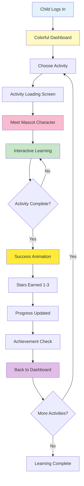

# Child's First Day on BrightBook: Complete Learning Journey

**Document Version:** 1.0
**Last Updated:** 2025-01-07
**Target Audience:** Parents, Educators, Child Psychologists, UX Designers, Developers

---

## 🎯 Executive Summary (High-Level Overview)

This document explores a child's complete experience on BrightBook, from their first login through completing activities and earning achievements. The platform is designed specifically for children ages 3-8 with dyslexia, providing an engaging, gamified interface that makes reading intervention fun and rewarding.

### A Child's Day in 60 Seconds:
1. **Login** → Parent helps child log in
2. **Dashboard** → Child sees their learning world with activities
3. **Activity Selection** → Child chooses an activity (or parent guides them)
4. **Learning Mode** → Child completes interactive activities with mascot guidance
5. **Success Celebration** → Confetti, stars, and achievement unlocks
6. **Progress Tracking** → Child sees their progress on the level map
7. **Repeat** → Child motivated to continue learning journey

---

## 👶 Complete Child Journey Flow



---

## 🎨 Child User Interface Design

### Design Philosophy
**Target Age:** 3-8 years old
**Design Principles:**
- **Large touch targets**: Minimum 44x44px for small fingers
- **Visual feedback**: Immediate responses to all interactions
- **Simple navigation**: Maximum 2 taps to reach any activity
- **Engaging visuals**: Bright colors, mascots, animations
- **Positive reinforcement**: Celebration of all efforts

### Color Palette
```css
/* Primary Colors - Bright & Cheerful */
--primary-green: #4CAF50;    /* Success, progress */
--primary-blue: #2196F3;     /* Information, learning */
--primary-yellow: #FFC107;    /* Stars, achievements */
--primary-orange: #FF9800;    /* Warnings, attention */
--primary-red: #F44336;       /* Errors, mistakes */

/* Background Colors - Soft & Calming */
--bg-light: #FAFAFA;          /* Main background */
--bg-card: #FFFFFF;           /* Card backgrounds */
--bg-activity: #E8F5E9;       /* Activity areas */

/* Text Colors - High Contrast */
--text-primary: #212121;      /* Main text */
--text-secondary: #757575;     /* Secondary text */
--text-light: #FFFFFF;         /* White text on colored backgrounds */
```

---

## 🔧 Technical Deep-Dive: Child Experience Implementation

### Step 1: Child Login & Dashboard
**Files:**
- Frontend: `frontend/src/features/learning/pages/ChildDashboardPage.jsx`
- Backend: `backend/app/routers/learning.py`
- Route: `/learn`

**API Endpoint:** `GET /api/learning/activities/{child_id}`

**What Child Sees:**
- **Personalized greeting**: "Hi, Emma! 👋"
- **Current level display**: "Level 3 - Progressing"
- **Activity map**: Visual path showing completed and upcoming activities
- **Mascot character**: Friendly guide for current level
- **Stars earned**: Total achievement count
- **Streak counter**: Days of continuous learning

**Technical Implementation:**

**Dashboard Data Loading:**
```jsx
// ChildDashboardPage.jsx - Load child's learning world
useEffect(() => {
  if (selectedChild) {
    loadLearningWorld();
  }
}, [selectedChild]);

const loadLearningWorld = async () => {
  setLoading(true);
  try {
    // Load activities for this child
    const activitiesResponse = await api.get(`/api/learning/activities/${selectedChild.Child_ID}`);
    const activities = activitiesResponse.data;

    // Load progress data
    const progressResponse = await api.get(`/api/learning/progress/${selectedChild.Child_ID}`);
    const progress = progressResponse.data;

    // Organize activities into level map
    const levelList = buildLevelList(activities, progress);
    setLevelList(levelList);

    // Calculate overall mastery
    const mastery = calculateOverallMasteryLevel(activities, progress);
    setOverallMastery(mastery);

    // Load achievements
    const achievements = loadAchievements(progress);
    setAchievements(achievements);

  } catch (error) {
    toast.error('Failed to load your learning world!');
  } finally {
    setLoading(false);
  }
};
```

**Level Map Building:**
```jsx
// ChildDashboardPage.jsx - Build visual level map
const buildLevelList = (activities, progress) => {
  // Group activities by activity_group
  const grouped = {};
  activities.forEach(activity => {
    const group = activity.activity_group || 'ungrouped';
    if (!grouped[group]) {
      grouped[group] = [];
    }
    grouped[group].push(activity);
  });

  // Convert to level list format
  return Object.entries(grouped).map(([groupName, groupActivities]) => {
    // Get progress for each activity
    const activitiesWithProgress = groupActivities.map(activity => {
      const activityProgress = progress.activity_progress?.[activity.Activity_ID];
      return {
        ...activity,
        progress: activityProgress || {
          completion_status: 'not_started',
          stars_earned: 0,
          mastery_level: 0
        }
      };
    });

    // Calculate group completion
    const completedCount = activitiesWithProgress.filter(
      act => act.progress.completion_status === 'completed'
    ).length;
    const groupProgress = completedCount / activitiesWithProgress.length;

    return {
      group: groupName,
      activities: activitiesWithProgress,
      progress: groupProgress,
      mascot: getMascotForGroup(groupName)
    };
  });
};
```

**Dashboard UI Components:**
```jsx
// ChildDashboardPage.jsx - Render child-friendly dashboard
return (
  <div className="child-dashboard">
    {/* Header with greeting and stats */}
    <div className="dashboard-header">
      <h1>Hi, {selectedChild.name}! 👋</h1>
      <div className="stats-bar">
        <div className="stat-item">
          <span className="stat-icon">⭐</span>
          <span className="stat-value">{overallMastery.totalStars}</span>
        </div>
        <div className="stat-item">
          <span className="stat-icon">🔥</span>
          <span className="stat-value">{progress.streak_days}</span>
        </div>
        <div className="stat-item">
          <span className="stat-icon">🏆</span>
          <span className="stat-value">{achievements.length}</span>
        </div>
      </div>
    </div>

    {/* Level map with activities */}
    <div className="level-map">
      {levelList.map((level, index) => (
        <LevelNode
          key={level.group}
          level={level}
          index={index}
          onStartActivity={startActivity}
          isLocked={index > 0 && !levelList[index - 1].isCompleted}
        />
      ))}
    </div>

    {/* Achievements section */}
    <div className="achievements-section">
      <h2>Your Achievements 🎉</h2>
      <div className="achievements-grid">
        {achievements.map(achievement => (
          <AchievementBadge
            key={achievement.id}
            achievement={achievement}
            isUnlocked={achievement.unlocked}
          />
        ))}
      </div>
    </div>
  </div>
);
```

---

### Step 2: Activity Selection & Loading
**Files:**
- Frontend: `frontend/src/features/learning/pages/ActivityPage.jsx`
- Route: `/learn/activity/:id`

**What Child Experiences:**
1. **Activity Selection**: Child taps on an activity card
2. **Loading Screen**: Brief loading animation with mascot
3. **Activity Introduction**: Mascot explains what to do
4. **Interactive Learning**: Child completes the activity
5. **Success Celebration**: Stars, confetti, and encouragement

**Technical Implementation:**

**Activity Page Component:**
```jsx
// ActivityPage.jsx - Main activity interface
export default function ActivityPage() {
  const { activityId } = useParams();
  const [activity, setActivity] = useState(null);
  const [currentStep, setCurrentStep] = useState(0);
  const [answers, setAnswers] = useState([]);
  const [startTime, setStartTime] = useState(null);
  const [showCelebration, setShowCelebration] = useState(false);

  useEffect(() => {
    loadActivity();
  }, [activityId]);

  const loadActivity = async () => {
    try {
      const response = await api.get(`/api/learning/activity/${activityId}`);
      setActivity(response.data);
      setStartTime(Date.now());
    } catch (error) {
      toast.error('Failed to load activity');
    }
  };

  const handleAnswer = (answer) => {
    const timeSpent = Math.round((Date.now() - startTime) / 1000);

    // Record answer
    const answerData = {
      activity_id: activityId,
      step: currentStep,
      answer: answer,
      time_spent_seconds: timeSpent,
      timestamp: new Date().toISOString()
    };

    setAnswers([...answers, answerData]);

    // Move to next step or complete
    if (currentStep < getTotalSteps(activity) - 1) {
      setCurrentStep(currentStep + 1);
    } else {
      completeActivity();
    }
  };

  const completeActivity = async () => {
    try {
      const response = await api.post(`/api/learning/activity/${activityId}/complete`, {
        answers: answers,
        total_time_seconds: Math.round((Date.now() - startTime) / 1000)
      });

      // Show celebration
      setShowCelebration(true);

      // Update progress after celebration
      setTimeout(() => {
        navigate('/learn');
      }, 3000);

    } catch (error) {
      toast.error('Failed to complete activity');
    }
  };

  if (!activity) return <PageLoader />;

  return (
    <div className="activity-page">
      {showCelebration ? (
        <CelebrationScreen
          activity={activity}
          results={answers}
          onClose={() => navigate('/learn')}
        />
      ) : (
        <ActivityPlayer
          activity={activity}
          currentStep={currentStep}
          onAnswer={handleAnswer}
        />
      )}
    </div>
  );
}
```

**Activity Player Component:**
```jsx
// ActivityPlayer.jsx - Interactive activity interface
const ActivityPlayer = ({ activity, currentStep, onAnswer }) => {
  const { activity_content } = activity;
  const mascot = getMascot(activity.activity_group);

  // Render different activity types
  const renderActivityContent = () => {
    switch (activity.activity_type) {
      case 'meet_letter':
        return (
          <MeetLetterActivity
            letter={activity_content.letter}
            words={activity_content.words}
            wordEmojis={activity_content.word_emojis}
            instruction={activity_content.instruction}
            onComplete={onAnswer}
          />
        );

      case 'sound_blender':
        return (
          <SoundBlenderActivity
            letter={activity_content.letter}
            words={activity_content.words}
            wordEmojis={activity_content.word_emojis}
            instruction={activity_content.instruction}
            onComplete={onAnswer}
          />
        );

      case 'mini_quest':
        return (
          <MiniQuestActivity
            letter={activity_content.letter}
            words={activity_content.words}
            instruction={activity_content.instruction}
            onComplete={onAnswer}
          />
        );

      default:
        return (
          <GenericActivity
            content={activity_content}
            onComplete={onAnswer}
          />
        );
    }
  };

  return (
    <div className="activity-player">
      {/* Mascot guide */}
      <div className="mascot-guide">
        <MascotCharacter
          mascot={mascot}
          message={getMascotInstruction(activity, currentStep)}
        />
      </div>

      {/* Progress indicator */}
      <div className="progress-bar">
        <div
          className="progress-fill"
          style={{ width: `${((currentStep + 1) / getTotalSteps(activity)) * 100}%` }}
        />
      </div>

      {/* Activity content */}
      <div className="activity-content">
        {renderActivityContent()}
      </div>

      {/* Encouragement */}
      <div className="encouragement">
        <p>You're doing great! {getEncouragementPhrase(currentStep)}</p>
      </div>
    </div>
  );
};
```

---

### Step 3: Interactive Activity Types

#### Meet Letter Activity
**File:** `frontend/src/features/learning/components/MeetLetterActivity.jsx`

**What Child Does:**
1. Sees a large letter (e.g., "G")
2. Meets 3 words starting with that letter (GIRAFFE 🦒, GOAT 🐐, GRAPE 🍇)
3. Hears the letter sound
4. Taps on each word to hear it pronounced
5. Practices tracing the letter
6. Completes fun quiz to identify the letter

**Technical Implementation:**
```jsx
// MeetLetterActivity.jsx
const MeetLetterActivity = ({ letter, words, wordEmojis, instruction, onComplete }) => {
  const [step, setStep] = useState(0);
  const [tracingPath, setTracingPath] = useState([]);

  const steps = [
    'introduction',    // Meet the letter
    'words_intro',     // See words with emojis
    'sound_practice',  // Hear letter sound
    'tracing',         // Trace the letter
    'quiz'            // Test knowledge
  ];

  const renderStep = () => {
    switch (steps[step]) {
      case 'introduction':
        return (
          <div className="letter-introduction">
            <h1>Meet the Letter {letter}!</h1>
            <div className="letter-display">{letter}</div>
            <button onClick={() => playSound(letter)}>🔊 Hear {letter} Sound</button>
            <button onClick={() => setStep(step + 1)}>Let's Learn! →</button>
          </div>
        );

      case 'words_intro':
        return (
          <div className="words-introduction">
            <h2>Words Starting with {letter}</h2>
            <div className="words-grid">
              {words.map((word, index) => (
                <div
                  key={index}
                  className="word-card"
                  onClick={() => playWordSound(word)}
                >
                  <span className="word-emoji">{wordEmojis[index]}</span>
                  <span className="word-text">{word}</span>
                  <span className="sound-icon">🔊</span>
                </div>
              ))}
            </div>
            <button onClick={() => setStep(step + 1)}>Continue →</button>
          </div>
        );

      case 'sound_practice':
        return (
          <div className="sound-practice">
            <h2>Practice the {letter} Sound</h2>
            <SoundRecorder
              targetLetter={letter}
              onMatch={() => handleSoundMatch()}
            />
          </div>
        );

      case 'tracing':
        return (
          <div className="letter-tracing">
            <h2>Trace Letter {letter}</h2>
            <Canvas
              width={300}
              height={300}
              onPathChange={setTracingPath}
              templateLetter={letter}
            />
            <button onClick={() => checkTracing(tracingPath, letter)}>
              Check My Tracing!
            </button>
          </div>
        );

      case 'quiz':
        return (
          <div className="letter-quiz">
            <h2>Find the Letter {letter}!</h2>
            <LetterQuiz
              targetLetter={letter}
              options={generateQuizOptions(letter)}
              onCorrect={() => {
                setShowConfetti(true);
                setTimeout(() => onComplete(), 2000);
              }}
            />
          </div>
        );
    }
  };

  return (
    <div className="meet-letter-activity">
      {renderStep()}
    </div>
  );
};
```

#### Sound Blender Activity
**File:** `frontend/src/features/learning/components/SoundBlenderActivity.jsx`

**What Child Does:**
1. Sees a word broken into sounds (e.g., "C-A-T" → "CAT")
2. Taps each sound button to hear it
3. Blends sounds together by tapping in sequence
4. Matches the blended word to the correct emoji
5. Earns stars for accuracy

**Technical Implementation:**
```jsx
// SoundBlenderActivity.jsx
const SoundBlenderActivity = ({ letter, words, wordEmojis, instruction, onComplete }) => {
  const [currentWordIndex, setCurrentWordIndex] = useState(0);
  const [blendedSounds, setBlendedSounds] = useState([]);
  const [isCorrect, setIsCorrect] = useState(null);

  const currentWord = words[currentWordIndex];
  const currentEmoji = wordEmojis[currentWordIndex];

  // Break word into individual sounds
  const wordSounds = breakWordIntoSounds(currentWord);

  const handleSoundTap = (sound, index) => {
    playSound(sound);

    // Add to blended sounds
    const newBlended = [...blendedSounds, sound];
    setBlendedSounds(newBlended);

    // Check if complete word is blended
    if (newBlended.length === wordSounds.length) {
      const blendedWord = newBlended.join('');
      const correct = blendedWord.toLowerCase() === currentWord.toLowerCase();

      setIsCorrect(correct);

      if (correct) {
        playSuccessSound();
        setTimeout(() => {
          moveToNextWord();
        }, 1500);
      } else {
        playTryAgainSound();
        setTimeout(() => {
          setBlendedSounds([]);
          setIsCorrect(null);
        }, 1000);
      }
    }
  };

  const moveToNextWord = () => {
    if (currentWordIndex < words.length - 1) {
      setCurrentWordIndex(currentWordIndex + 1);
      setBlendedSounds([]);
      setIsCorrect(null);
    } else {
      // Activity complete!
      onComplete({
        score: calculateScore(),
        accuracy: calculateAccuracy(),
        time_spent: calculateTimeSpent()
      });
    }
  };

  return (
    <div className="sound-blender-activity">
      <h2>Blend the Sounds!</h2>

      <div className="word-display">
        <div className="target-emoji">{currentEmoji}</div>
        <div className="target-word-hint">
          Tap the sounds in order: {wordSounds.join(' - ')}
        </div>
      </div>

      <div className="sound-buttons">
        {wordSounds.map((sound, index) => (
          <button
            key={index}
            className="sound-button"
            onClick={() => handleSoundTap(sound, index)}
            disabled={blendedSounds.length > index}
          >
            {sound}
          </button>
        ))}
      </div>

      <div className="blended-result">
        <p>Blended Word:</p>
        <div className="blended-sounds">
          {blendedSounds.map((sound, index) => (
            <span key={index} className="blended-sound">{sound}</span>
          ))}
        </div>
        {isCorrect !== null && (
          <div className={`result ${isCorrect ? 'correct' : 'incorrect'}`}>
            {isCorrect ? '🎉 Correct!' : '🤔 Try Again!'}
          </div>
        )}
      </div>
    </div>
  );
};
```

---

### Step 4: Success Celebration & Progress Update
**Files:**
- Frontend: `frontend/src/features/learning/components/CelebrationScreen.jsx`
- Backend: `backend/app/routers/learning.py`

**API Endpoint:** `POST /api/learning/activity/{id}/complete`

**What Child Experiences:**
1. **Confetti Explosion**: Colorful confetti animation
2. **Star Rating**: 1-3 stars based on performance
3. **Achievement Unlock**: New badges earned
4. **Mascot Celebration**: Mascot cheers and dances
5. **Progress Update**: See progress bar advance
6. **Next Activity Preview**: Teaser for what's next

**Technical Implementation:**

**Celebration Screen:**
```jsx
// CelebrationScreen.jsx
const CelebrationScreen = ({ activity, results, onClose }) => {
  const [stars, setStars] = useState(0);
  const [showConfetti, setShowConfetti] = useState(true);
  const [newAchievements, setNewAchievements] = useState([]);

  useEffect(() => {
    // Calculate stars based on performance
    const calculatedStars = calculateStars(results);
    animateStars(calculatedStars);

    // Check for new achievements
    const achievements = checkAchievements(activity, results);
    setNewAchievements(achievements);

    // Trigger confetti
    if (window.confetti) {
      window.confetti({
        particleCount: 150,
        spread: 70,
        origin: { y: 0.6 }
      });
    }
  }, []);

  const animateStars = (targetStars) => {
    let current = 0;
    const interval = setInterval(() => {
      if (current < targetStars) {
        current++;
        setStars(current);
        playStarSound();
      } else {
        clearInterval(interval);
      }
    }, 500);
  };

  return (
    <div className="celebration-screen">
      {showConfetti && <Confetti />}

      <div className="celebration-content">
        <h1>🎉 Amazing Work! 🎉</h1>

        <div className="stars-display">
          {[1, 2, 3].map(star => (
            <span
              key={star}
              className={`star ${star <= stars ? 'earned' : 'unearned'}`}
            >
                ⭐
              </span>
          ))}
        </div>

        <div className="achievement-unlocks">
          {newAchievements.map(achievement => (
            <div key={achievement.id} className="new-achievement">
              <span className="achievement-emoji">{achievement.emoji}</span>
              <span className="achievement-name">{achievement.name}</span>
              <span className="achievement-text">Unlocked!</span>
            </div>
          ))}
        </div>

        <div className="mascot-celebration">
          <MascotCharacter
            mascot={getMascot(activity.activity_group)}
            message={getCelebrationMessage(stars)}
            animation="dance"
          />
        </div>

        <button className="continue-button" onClick={onClose}>
          Continue Learning →
        </button>
      </div>
    </div>
  );
};
```

**Backend Progress Update:**
```python
# learning.py - Complete activity endpoint
@router.post("/activity/{activity_id}/complete", response_model=ActivityProgressRead)
def complete_activity(
    activity_id: int,
    data: ActivityCompletion,
    child: Child = Depends(get_current_child),
    session: Session = Depends(get_session),
):
    # Get activity
    activity = session.get(Activity, activity_id)
    if not activity or activity.Child_ID != child.Child_ID:
        raise HTTPException(status_code=404, detail="Activity not found")

    # Get progress record
    progress = session.exec(
        select(Progress).where(Progress.Child_ID == child.Child_ID)
    ).first()

    if not progress:
        raise HTTPException(status_code=404, detail="Progress record not found")

    # Get or create activity progress
    activity_progress = session.exec(
        select(ActivityProgress).where(
            ActivityProgress.progress_id == progress.progress_id,
            ActivityProgress.activity_id == activity_id
        )
    ).first()

    if not activity_progress:
        activity_progress = ActivityProgress(
            progress_id=progress.progress_id,
            activity_id=activity_id,
            completion_status='not_started',
            stars_earned=0,
            mastery_level=0,
            total_time_spent_minutes=0,
            total_activities_completed=0
        )
        session.add(activity_progress)

    # Calculate performance metrics
    score = calculate_activity_score(data.answers, activity)
    stars_earned = calculate_stars(score)
    mastery_level = calculate_mastery(score, activity_progress.mastery_level)

    # Update activity progress
    activity_progress.completion_status = 'completed'
    activity_progress.stars_earned = stars_earned
    activity_progress.mastery_level = mastery_level
    activity_progress.total_time_spent_minutes += data.total_time_seconds // 60
    activity_progress.total_activities_completed += 1

    session.add(activity_progress)

    # Update overall progress
    progress.total_score += score

    # Update child progress streak
    child_progress = session.exec(
        select(ChildProgress).where(
            ChildProgress.progress_id == progress.progress_id
        )
    ).first()

    if child_progress:
        child_progress.streak_days = calculate_streak(child.Child_ID, session)
        session.add(child_progress)

    session.commit()
    session.refresh(activity_progress)

    return activity_progress
```

---

### Step 5: Achievement System
**Files:**
- Frontend: `frontend/src/features/learning/utils/achievements.js`
- Backend: `backend/app/services/achievement_service.py`

**Achievement Categories:**

#### 1. Skill Badges (5 achievements)
```javascript
// Skill-based achievements
const SKILL_ACHIEVEMENTS = [
  {
    id: 'first_steps',
    name: 'First Steps',
    emoji: '🌱',
    description: 'Complete Level 1',
    requirement: { type: 'level', value: 1 },
    color: '#ffdf9e',
    iconColor: '#785900'
  },
  {
    id: 'letter_hero',
    name: 'Letter Hero',
    emoji: '🔤',
    description: 'Complete Stage 1',
    requirement: { type: 'stage', value: 1 },
    color: '#e8f5e9',
    iconColor: '#2e7d32'
  },
  {
    id: 'sound_detective',
    name: 'Sound Detective',
    emoji: '🔊',
    description: 'Complete Stage 2',
    requirement: { type: 'stage', value: 2 },
    color: '#d1e4ff',
    iconColor: '#0061a4'
  },
  {
    id: 'word_builder',
    name: 'Word Builder',
    emoji: '🧱',
    description: 'Complete Stage 3',
    requirement: { type: 'stage', value: 3 },
    color: '#f3e5f5',
    iconColor: '#ab47bc'
  },
  {
    id: 'reading_star',
    name: 'Reading Star',
    emoji: '⭐',
    description: 'Complete Stage 4',
    requirement: { type: 'stage', value: 4 },
    color: '#fff9c4',
    iconColor: '#ff6d00'
  }
];
```

#### 2. Performance Badges (4 achievements)
```javascript
// Performance-based achievements
const PERFORMANCE_ACHIEVEMENTS = [
  {
    id: 'speed_reader',
    name: 'Speed Reader',
    emoji: '⚡',
    description: '3 levels with fastest tier',
    requirement: { type: 'speed_tier', count: 3 },
    color: '#ffecb3',
    iconColor: '#ff8f00'
  },
  {
    id: 'perfect_score',
    name: 'Perfect Score',
    emoji: '💯',
    description: '5 levels with ⭐⭐⭐',
    requirement: { type: 'three_stars', count: 5 },
    color: '#c8e6c9',
    iconColor: '#388e3c'
  },
  {
    id: 'sharp_shooter',
    name: 'Sharp Shooter',
    emoji: '🎯',
    description: '10 questions correct in a row',
    requirement: { type: 'streak', value: 10 },
    color: '#b39ddb',
    iconColor: '#5e35b1'
  },
  {
    id: 'wise_owl',
    name: 'Wise Owl',
    emoji: '🦉',
    description: '3-star rating on stage evaluation',
    requirement: { type: 'stage_rating', stars: 3 },
    color: '#b3e5fc',
    iconColor: '#0277bd'
  }
];
```

#### 3. Habit Badges (3 achievements)
```javascript
// Habit-based achievements
const HABIT_ACHIEVEMENTS = [
  {
    id: 'three_day_streak',
    name: 'Three Day Streak',
    emoji: '🔥',
    description: 'Play 3 days in a row',
    requirement: { type: 'streak_days', value: 3 },
    color: '#ffccbc',
    iconColor: '#d84315'
  },
  {
    id: 'weekly_warrior',
    name: 'Weekly Warrior',
    emoji: '📅',
    description: 'Play 7 days in a row',
    requirement: { type: 'streak_days', value: 7 },
    color: '#ffccbc',
    iconColor: '#d84315'
  },
  {
    id: 'dedicated_learner',
    name: 'Dedicated Learner',
    emoji: '💎',
    description: 'Play 20 total days',
    requirement: { type: 'total_days', value: 20 },
    color: '#e1bee7',
    iconColor: '#7b1fa2'
  }
];
```

**Achievement Checking System:**
```javascript
// achievements.js - Check for new achievements
export const checkAchievements = (activity, results, childProgress) => {
  const newAchievements = [];
  const allAchievements = [
    ...SKILL_ACHIEVEMENTS,
    ...PERFORMANCE_ACHIEVEMENTS,
    ...HABIT_ACHIEVEMENTS
  ];

  allAchievements.forEach(achievement => {
    // Skip if already unlocked
    if (childProgress.achievements?.includes(achievement.id)) {
      return;
    }

    // Check if requirement is met
    if (checkRequirement(achievement.requirement, activity, results, childProgress)) {
      newAchievements.push(achievement);
    }
  });

  return newAchievements;
};

const checkRequirement = (requirement, activity, results, childProgress) => {
  switch (requirement.type) {
    case 'level':
      return childProgress.current_level >= requirement.value;

    case 'stage':
      return childProgress.completed_stages >= requirement.value;

    case 'streak':
      return results.correct_streak >= requirement.value;

    case 'three_stars':
      return childProgress.three_star_activities >= requirement.count;

    case 'streak_days':
      return childProgress.streak_days >= requirement.value;

    case 'total_days':
      return childProgress.total_active_days >= requirement.value;

    default:
      return false;
  }
};
```

---

## 🎮 Gamification Elements

### Progress Visualization
**Level Map Design:**
```jsx
// LevelMap.jsx - Visual progress representation
const LevelMap = ({ activities, progress }) => {
  const nodes = buildLevelNodes(activities, progress);

  return (
    <div className="level-map">
      <svg className="map-svg" viewBox="0 0 1200 400">
        {/* Path line */}
        <path
          d="M 50 200 Q 300 100 600 200 T 1150 200"
          stroke="#ddd"
          strokeWidth="4"
          fill="none"
        />

        {/* Progress line */}
        <path
          d={calculateProgressPath(nodes)}
          stroke="#4CAF50"
          strokeWidth="4"
          fill="none"
          className="progress-path"
        />

        {/* Activity nodes */}
        {nodes.map((node, index) => (
          <g key={index} transform={`translate(${node.x}, ${node.y})`}>
            {/* Node circle */}
            <circle
              r={node.radius}
              fill={node.completed ? '#4CAF50' : '#FFF'}
              stroke={node.current ? '#FFC107' : '#2196F3'}
              strokeWidth={node.current ? 4 : 2}
              className={node.current ? 'current-node' : ''}
            />

            {/* Emoji/icon */}
            <text
              x={0}
              y={0}
              textAnchor="middle"
              dominantBaseline="middle"
              fontSize={24}
            >
              {node.emoji}
            </text>

            {/* Stars if completed */}
            {node.completed && (
              <text
                x={0}
                y={30}
                textAnchor="middle"
                fontSize={16}
              >
                {'⭐'.repeat(node.stars)}
              </text>
            )}

            {/* Activity name */}
            <text
              x={0}
              y={50}
              textAnchor="middle"
              fontSize={12}
              fill="#666"
            >
              {node.name}
            </text>
          </g>
        ))}
      </svg>
    </div>
  );
};
```

### Mascot Characters
**Mascot System:**
```javascript
// mascots.js - Mascot character data
const MASCOTS = {
  group_1: {
    name: "Sammy Squirrel",
    emoji: "🐿️",
    personality: "energetic",
    color: "#8D6E63",
    phrases: [
      "Let's learn together!",
      "You're doing amazing!",
      "Great job!",
      "Let's try another one!"
    ]
  },
  group_2: {
    name: "Penny Penguin",
    emoji: "🐧",
    personality: "friendly",
    color: "#90CAF9",
    phrases: [
      "Waddle we learn next?",
      "You're so smart!",
      "Ice job!",
      "Keep sliding forward!"
    ]
  },
  group_3: {
    name: "Gerry Giraffe",
    emoji: "🦒",
    personality: "wise",
    color: "#FFCC80",
    phrases: [
      "Reach for the stars!",
      "You're growing taller every day!",
      "Stick your neck out and try!",
      "You're heads above the rest!"
    ]
  }
};

export const getMascot = (group) => {
  return MASCOTS[group] || MASCOTS.group_1;
};

export const getMascotPhrase = (group, context) => {
  const mascot = getMascot(group);
  const phrases = mascot.phrases;

  return phrases[Math.floor(Math.random() * phrases.length)];
};
```

---

## 📊 Progress Tracking & Analytics

### Real-time Progress Monitoring
**Socket.IO Integration:**
```javascript
// useActivityProgress.js - Real-time progress hook
export const useActivityProgress = (childId) => {
  const [progress, setProgress] = useState(null);
  const [socket, setSocket] = useState(null);

  useEffect(() => {
    // Connect to Socket.IO
    const socketInstance = io(`${import.meta.env.VITE_API_URL}/ws`, {
      auth: {
        token: localStorage.getItem('access_token')
      }
    });

    // Join child's progress room
    socketInstance.emit('join_child_progress', { child_id: childId });

    // Listen for progress updates
    socketInstance.on('progress_update', (data) => {
      setProgress(data);
    });

    setSocket(socketInstance);

    return () => {
      socketInstance.disconnect();
    };
  }, [childId]);

  return progress;
};
```

**Parent Monitoring Dashboard:**
```jsx
// ParentProgressMonitor.jsx - Real-time parent view
const ParentProgressMonitor = ({ childId }) => {
  const progress = useActivityProgress(childId);

  if (!progress) {
    return <div>Waiting for child to start activity...</div>;
  }

  return (
    <div className="progress-monitor">
      <h3>{progress.child_name}'s Progress</h3>

      <div className="current-activity">
        <p>Activity: {progress.current_activity}</p>
        <div className="progress-bar">
          <div
            className="progress-fill"
            style={{ width: `${progress.completion_percentage}%` }}
          />
        </div>
        <p>{progress.completion_percentage}% Complete</p>
      </div>

      <div className="live-stats">
        <div className="stat">
          <span className="stat-label">Time Spent:</span>
          <span className="stat-value">{progress.time_spent_minutes} min</span>
        </div>
        <div className="stat">
          <span className="stat-label">Questions Correct:</span>
          <span className="stat-value">{progress.correct_answers}/{progress.total_questions}</span>
        </div>
        <div className="stat">
          <span className="stat-label">Current Streak:</span>
          <span className="stat-value">{progress.streak}🔥</span>
        </div>
      </div>
    </div>
  );
};
```

---

## 🚀 Performance Metrics

### Child Engagement Metrics
- **Activity Completion Rate**: Target > 85%
- **Average Session Duration**: 15-20 minutes
- **Return Rate**: Target > 70% daily active users
- **Achievement Unlock Rate**: Target > 60% unlock at least one achievement/week

### Learning Outcome Metrics
- **Literacy Level Improvement**: Target 1 level advance per month
- **Skill Retention**: Target > 80% retention after 1 week
- **Parent Satisfaction**: Target > 4.5/5 stars
- **Teacher Validation**: Target > 90% accuracy in level placement

---

## 🎨 Accessibility & Inclusive Design

### Age-Appropriate Design
- **3-4 years**: Simpler activities, more visual cues, less text
- **5-6 years**: Balanced activities, clear instructions, moderate challenge
- **7-8 years**: Complex activities, independent learning, advanced content

### Special Needs Support
- **Audio instructions**: For children with reading difficulties
- **Visual aids**: For children with hearing impairments
- **Adjustable difficulty**: For children with learning disabilities
- **Extended time**: For children who need more time per activity

---

## 📚 Related Documentation

- **Parent Journey**: `from_signup_to_first_activity.md`
- **AI Assessment Flow**: `how_assessment_becomes_learning_plan.md`
- **System Architecture**: `brightbook_architecture_data_flow.md`
- **Admin Operations**: `admin_content_management_studio.md`

---

**Document End**

*This documentation covers the complete child experience on BrightBook, from login through activity completion and achievement earning. The platform is designed to make dyslexia intervention engaging, rewarding, and effective for children ages 3-8.*