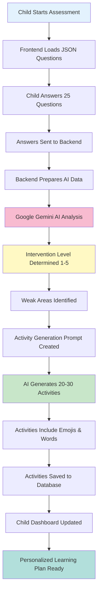

# How Assessment Becomes Learning Plan: AI Assessment Flow

**Document Version:** 1.0
**Last Updated:** 2025-01-07
**Target Audience:** Developers, AI Engineers, Curriculum Designers, Technical Stakeholders

---

## 🎯 Executive Summary (High-Level Overview)

This document explains how BrightBook transforms a child's assessment results into a personalized learning plan using Google Gemini AI. The process takes 3-5 seconds and converts raw assessment data into 20-30 customized learning activities with specific words, emojis, and difficulty levels.

### The Magic in 60 Seconds:
1. **Child completes assessment** → 25 questions, 5-10 minutes
2. **Answers collected** → Time, accuracy, patterns recorded
3. **AI receives data** → Question results + child profile sent to Google Gemini
4. **AI analyzes performance** → Determines intervention level (1-5), identifies strengths/weaknesses
5. **AI generates activities** → Creates 20-30 personalized activities with emojis
6. **Activities stored** → Saved to database for child to complete
7. **Learning plan ready** → Child sees customized activities in their dashboard

---

## 🤖 Complete AI Assessment Flow



---

## 🔧 Technical Deep-Dive: Step-by-Step AI Implementation

### Step 1: Assessment Data Collection
**Files:**
- Frontend: `frontend/src/features/assessment/pages/AssessmentPage.jsx`
- Backend: `backend/app/routers/assessments.py`

**What Data Is Collected:**
For each of the 25 questions, the system records:
```json
{
  "question_id": 1,
  "is_correct": true,
  "time_spent_seconds": 15,
  "difficulty": "medium",
  "question_type": "capital_to_lowercase_match",
  "child_answer": "a"
}
```

**Data Collection Process:**

**Frontend Question Rendering:**
```jsx
// AssessmentPage.jsx - Question rendering
const renderQuestion = (question) => {
  const startTime = Date.now();

  const handleAnswer = (answer) => {
    const timeSpent = Math.round((Date.now() - startTime) / 1000);

    // Submit answer to backend
    submitAnswer(question.id, {
      question_id: question.id,
      child_answer: answer,
      is_correct: checkCorrectAnswer(question, answer),
      time_spent_seconds: timeSpent,
      question_type: question.type,
      question_content: question
    });
  };

  return (
    <QuestionCard
      question={question}
      onAnswer={handleAnswer}
      startTime={startTime}
    />
  );
};
```

**Backend Answer Storage:**
```python
# assessments.py - Submit answer endpoint
@router.post("/{assessment_id}/answer", response_model=AssessmentQuestionRead, status_code=201)
def submit_answer(
    assessment_id: int,
    data: AnswerSubmit,
    parent: Parents = Depends(get_current_parent),
    session: Session = Depends(get_session),
):
    # Verify assessment belongs to parent's child
    assessment = session.get(Assessment, assessment_id)
    if not assessment:
        raise HTTPException(status_code=404, detail="Assessment not found")

    child = session.get(Child, assessment.Child_ID)
    if not child or child.Parent_ID != parent.Parent_ID:
        raise HTTPException(status_code=403, detail="Not authorized")

    # Find or create question record
    statement = select(AssessmentQuestion).where(
        AssessmentQuestion.Question_ID == data.question_id,
        AssessmentQuestion.Assessment_ID == assessment_id
    )
    question = session.exec(statement).first()

    if not question:
        question = AssessmentQuestion(
            Question_ID=data.question_id,
            Assessment_ID=assessment_id,
            question_type=data.question_type or "unknown",
            question_content=data.question_content or "{}",
            correct_answer=data.correct_answer or "",
        )

    # Store answer data
    question.child_answer = str(data.child_answer)
    question.is_correct = data.is_correct
    question.time_spent_seconds = data.time_spent_seconds

    session.add(question)
    session.commit()
    session.refresh(question)

    return question
```

---

### Step 2: AI Analysis Request Preparation
**Files:**
- Backend: `backend/app/routers/assessments.py` (complete endpoint)
- AI Service: `backend/app/services/ai_service.py`

**What Data Is Sent to AI:**

**1. Assessment Results:**
```json
{
  "responses": [
    {
      "question_id": 1,
      "is_correct": true,
      "time_spent_seconds": 15,
      "difficulty": "medium"
    },
    {
      "question_id": 2,
      "is_correct": false,
      "time_spent_seconds": 22,
      "difficulty": "medium"
    }
    // ... 23 more responses
  ],
  "child_age": 6
}
```

**2. Child Profile:**
```json
{
  "child_id": 1,
  "child_name": "Emma",
  "child_age": 6,
  "native_language": "English"
}
```

**AI Prompt Construction:**
```python
# ai_service.py - Building the AI prompt
def analyze_assessment(
    responses: List[Dict[str, Any]],
    child_age: int,
) -> Dict[str, Any]:
    """
    Real AI-powered assessment analysis using Google Gemini
    """

    # Calculate basic metrics
    total = len(responses)
    correct = sum(1 for r in responses if r.get("is_correct"))
    accuracy = (correct / total) * 100

    # Build comprehensive AI prompt
    assessment_prompt = f"""
    You are a expert children's dyslexia assessment specialist. Analyze these assessment results:

    Child Age: {child_age} years old
    Total Questions: {total}
    Correct Answers: {correct}
    Accuracy: {accuracy:.1f}%

    Question Results:
    {json.dumps(responses, indent=2)}

    Please provide a detailed analysis and respond ONLY in valid JSON format with this exact structure:
    {{
        "intervention_level": <1-5 based on performance>,
        "confidence_score": <0.0-1.0 confidence in your assessment>,
        "weak_areas": [<list of specific areas needing work>],
        "ai_analysis_text": "<detailed explanation for parents in simple, encouraging language>",
        "recommended_focus": "<single most important area to focus on>",
        "strength_areas": [<list of areas the child is doing well in>],
        "suggested_activities": [<list of specific activity types to start with>]
    }}

    Level Guidelines:
    - Level 1: Beginner (0-40% accuracy) - Focus on letter recognition, basic phonics
    - Level 2: Developing (40-60% accuracy) - Focus on phonics, letter sounds, basic words
    - Level 3: Progressing (60-80% accuracy) - Focus on word formation, blending, sight words
    - Level 4: Advanced (80-90% accuracy) - Focus on reading comprehension, sentences
    - Level 5: Excellent (90%+ accuracy) - Focus on advanced reading, vocabulary, stories

    Activity Types Available: {', '.join([t.value for t in ActivityType])}

    Provide specific, actionable insights that will help create a personalized learning path.
    """

    return assessment_prompt
```

---

### Step 3: Google Gemini AI Analysis
**Files:**
- AI Service: `backend/app/services/ai_service.py`
- Configuration: `backend/app/config/settings.py`

**API Call:**
```python
# ai_service.py - Calling Google Gemini
from google import genai
from app.config.settings import settings

# Configure Gemini API
client = genai.Client(api_key=settings.GEMINI_API_KEY)
GEMINI_MODEL = "models/gemini-flash-latest"

try:
    # Call Gemini API with comprehensive prompt
    response = client.models.generate_content(
        model=GEMINI_MODEL,
        contents=assessment_prompt
    )
    result_text = response.text.strip()

    # Extract JSON from response (in case there's extra text)
    if "```json" in result_text:
        result_text = result_text.split("```json")[1].split("```")[0].strip()
    elif "```" in result_text:
        result_text = result_text.split("```")[1].split("```")[0].strip()

    # Parse AI response
    ai_result = json.loads(result_text)

    # Add calculated metrics
    ai_result["accuracy_percentage"] = round(accuracy, 2)
    ai_result["total_correct"] = correct

    return ai_result

except Exception as e:
    # Fallback to rule-based if AI fails
    return _fallback_analysis(responses, child_age)
```

**Sample AI Response:**
```json
{
  "literacy_level": 3,
  "confidence_score": 0.85,
  "weak_areas": ["blending", "sight_words"],
  "ai_analysis_text": "Emma shows strong letter recognition skills and is progressing well in phonics. She can benefit from more practice with blending sounds and recognizing common sight words.",
  "recommended_focus": "blending_practice",
  "strength_areas": ["letter_recognition", "phonics", "letter_sounds"],
  "suggested_activities": ["sound_blender", "word_builder", "sight_word_match"],
  "accuracy_percentage": 72.0,
  "total_correct": 18
}
```

---

### Step 4: Activity Generation Prompt Construction
**Files:**
- AI Service: `backend/app/services/ai_service.py`

**Letter Group Selection (Jolly Phonics Methodology):**
```python
# ai_service.py - Letter groups based on literacy level
letter_groups = {
    1: ['S', 'A', 'T', 'I', 'P', 'N'],      # Level 1: First letters learned
    2: ['C', 'K', 'E', 'H', 'R', 'M', 'D'], # Level 2: Second group
    3: ['G', 'O', 'U', 'L', 'F', 'B'],      # Level 3: Third group
    4: ['J', 'V', 'W', 'X'],                # Level 4: Fourth group
    5: ['Y', 'Z', 'Q']                       # Level 5: Final letters
}

current_letters = letter_groups.get(literacy_level, letter_groups[1])
# For Level 3: ['G', 'O', 'U', 'L', 'F', 'B']
```

**Emoji Mapping Construction:**
```python
# ai_service.py - Emoji mapping for current letters
emoji_mapping = {}
for letter in current_letters:
    if letter in LETTER_EMOJI_MAPPING:
        emoji_mapping[letter] = LETTER_EMOJI_MAPPING[letter]

# Result for Level 3:
# {
#   'G': [{'word': 'GIRAFFE', 'emoji': '🦒'}, {'word': 'GOAT', 'emoji': '🐐'}, ...],
#   'O': [{'word': 'OCTOPUS', 'emoji': '🐙'}, {'word': 'OWL', 'emoji': '🦉'}, ...],
#   'U': [{'word': 'UMBRELLA', 'emoji': '☂️'}, {'word': 'UNICORN', 'emoji': '🦄'}, ...],
#   'L': [{'word': 'LION', 'emoji': '🦁'}, {'word': 'LEAF', 'emoji': '🍃'}, ...],
#   'F': [{'word': 'FISH', 'emoji': '🐟'}, {'word': 'FROG', 'emoji': '🐸'}, ...],
#   'B': [{'word': 'BEAR', 'emoji': '🐻'}, {'word': 'BALL', 'emoji': '⚽'}, ...]
# }
```

**Activity Generation Prompt:**
```python
# ai_service.py - Building activity generation prompt
activity_generation_prompt = f"""
You are a specialized curriculum designer for children's literacy education.

Child Profile:
- Name: {child_name}
- Age: {child_age} years old
- Literacy Level: {literacy_level}/5
- Native Language: {native_language}
- Areas Needing Focus: {', '.join(weak_areas) if weak_areas else 'General practice'}
- Current Letter Group: {', '.join(current_letters)}

{completed_summary}

Available Activity Types: {', '.join([t.value for t in ActivityType])}

EMOJI MAPPING FOR CURRENT LETTERS (CRITICAL - USE THESE EXACT EMOJIS):
{json.dumps(emoji_mapping, indent=2)}

Create 20-30 specific learning activities personalized for this child. Focus on VARIETY and NO Repetition.

Respond ONLY in valid JSON format:
{{
    "activities": [
        {{
            "activity_name": "<specific unique name like 'Master Letter G Advanced' or 'Blend Sounds GO New Words'>",
            "activity_type": "<one of the available types>",
            "difficulty_level": "<beginner|easy|medium|hard|advanced>",
            "estimated_duration_minutes": <5-15>,
            "activity_content": {{
                "instruction": "<clear, simple instruction for the child>",
                "letter": "<single letter if applicable>",
                "words": [<list of 3-5 DIFFERENT words for word activities>],
                "word_emojis": [<list of matching emojis from the mapping above for each word>],
                "questions": [<list of questions for assessment activities>],
                "story": "<short story text for story activities>"
            }},
            "activity_group": "<letter group like 'group_1' for SATPIN letters>",
            "mascot_character": "<fun mascot name>",
            "is_boss_level": false
        }}
    ]
}}

Critical Guidelines:
- EMOJIS: You MUST include "word_emojis" array in activity_content with matching emojis for each word from the provided mapping
- Use EXACT words and emojis from the mapping above for the current letter group
- NEVER repeat exact same activity type + letter combinations
- Use NEW words that weren't in completed activities
- If practicing same letters, make activities HARDER/DIFFERENT (longer words, sentences, comprehension)
- Introduce activity types not commonly used before
- Focus on weak areas while maintaining variety
- Use age-appropriate but CHALLENGING content
- Make activities feel fresh and exciting, not repetitive
- Consider native language for cultural relevance
- Create activities that build on previous learning but aren't identical
"""
```

---

### Step 5: AI Activity Generation
**Files:**
- AI Service: `backend/app/services/ai_service.py`

**Activity Generation API Call:**
```python
# ai_service.py - Generate activities using AI
try:
    response = client.models.generate_content(
        model=GEMINI_MODEL,
        contents=activity_generation_prompt
    )
    result_text = response.text.strip()

    # Extract JSON from response
    if "```json" in result_text:
        result_text = result_text.split("```json")[1].split("```")[0].strip()
    elif "```" in result_text:
        result_text = result_text.split("```")[1].split("```")[0].strip()

    ai_result = json.loads(result_text)

    # Add Child_ID to each activity
    activities = ai_result.get("activities", [])
    for activity in activities:
        activity["Child_ID"] = child_id
        activity["language"] = native_language

    return activities

except Exception as e:
    # Return basic fallback activities if AI fails
    return _generate_fallback_activities(child_id, literacy_level, weak_areas, native_language, completed_activities)
```

**Sample AI Generated Activities:**
```json
{
  "activities": [
    {
      "activity_name": "Master Letter G with Giraffes and Goats",
      "activity_type": "meet_letter",
      "difficulty_level": "medium",
      "estimated_duration_minutes": 10,
      "activity_content": {
        "instruction": "Let's learn about the letter G! Look at these cool G words!",
        "letter": "G",
        "words": ["GIRAFFE", "GOAT", "GRAPE"],
        "word_emojis": ["🦒", "🐐", "🍇"],
        "questions": [],
        "story": ""
      },
      "activity_group": "group_3",
      "mascot_character": "Giraffe Guide",
      "is_boss_level": false,
      "Child_ID": 1,
      "language": "English"
    },
    {
      "activity_name": "Sound Blender with O Words",
      "activity_type": "sound_blender",
      "difficulty_level": "medium",
      "estimated_duration_minutes": 12,
      "activity_content": {
        "instruction": "Let's blend sounds to make O words! Can you say the sounds?",
        "letter": "O",
        "words": ["OCTOPUS", "OWL", "ORANGE"],
        "word_emojis": ["🐙", "🦉", "🍊"],
        "questions": [],
        "story": ""
      },
      "activity_group": "group_3_words",
      "mascot_character": "Owl Professor",
      "is_boss_level": true,
      "Child_ID": 1,
      "language": "English"
    }
    // ... 28 more activities
  ]
}
```

---

### Step 6: Activity Storage & Database Updates
**Files:**
- Backend: `backend/app/routers/assessments.py`

**Activity Storage Process:**
```python
# assessments.py - Store AI-generated activities
for activity_data in activities_data:
    try:
        # Handle activity_type enum conversion
        activity_type_str = activity_data.get("activity_type", "meet_letter")
        activity_type = ActivityType(activity_type_str)

        # Handle difficulty_level enum conversion
        difficulty_str = activity_data.get("difficulty_level", "beginner")
        difficulty_level = DifficultyLevel(difficulty_str)

        # Create activity in database
        new_activity = Activity(
            activity_name=activity_data["activity_name"],
            activity_type=activity_type,
            difficulty_level=difficulty_level,
            language=activity_data.get("language", "English"),
            activity_content=activity_data.get("activity_content", {}),
            estimated_duration_minutes=activity_data.get("estimated_duration_minutes", 10),
            Child_ID=activity_data["Child_ID"],
            activity_group=activity_data.get("activity_group", "group_1"),
            mascot_character=activity_data.get("mascot_character", "Learning Friend"),
            is_boss_level=activity_data.get("is_boss_level", False)
        )
        session.add(new_activity)
        session.commit()
        session.refresh(new_activity)
        created_count += 1

    except Exception as e:
        print(f"Error creating activity {activity_data.get('activity_name')}: {e}")
        continue
```

**Progress Initialization:**
```python
# assessments.py - Initialize progress records
if created_count > 0:
    progress = session.exec(
        select(Progress).where(Progress.Child_ID == assessment.Child_ID)
    ).first()

    if progress:
        # Get all activities for this child
        all_activities = session.exec(
            select(Activity).where(Activity.Child_ID == assessment.Child_ID)
        ).all()

        # Create progress records for new activities
        for activity in all_activities:
            existing_progress = session.exec(
                select(ActivityProgress).where(
                    ActivityProgress.progress_id == progress.progress_id,
                    ActivityProgress.activity_id == activity.Activity_ID
                )
            ).first()

            if not existing_progress:
                new_progress = ActivityProgress(
                    progress_id=progress.progress_id,
                    activity_id=activity.Activity_ID,
                    completion_status='not_started',
                    stars_earned=0,
                    mastery_level=0,
                    total_time_spent_minutes=0,
                    total_activities_completed=0
                )
                session.add(new_progress)

        session.commit()
```

---

### Step 7: Child Dashboard Update
**Files:**
- Frontend: `frontend/src/features/learning/pages/ChildDashboardPage.jsx`
- Backend: `backend/app/routers/learning.py`

**Dashboard Data Loading:**
```jsx
// ChildDashboardPage.jsx - Load activities after assessment
useEffect(() => {
  if (selectedChild) {
    loadActivities();
    loadProgress();
  }
}, [selectedChild]);

const loadActivities = async () => {
  try {
    const response = await api.get(`/api/learning/activities/${selectedChild.Child_ID}`);
    setActivities(response.data);

    // Filter and organize activities by group
    const organizedActivities = organizeByGroup(response.data);
    setLevelList(organizedActivities);
  } catch (error) {
    toast.error('Failed to load activities');
  }
};
```

**Activity Display in Dashboard:**
```jsx
// ChildDashboardPage.jsx - Render activities with emojis
const renderActivityCard = (activity) => {
  const { activity_content } = activity;
  const { words, word_emojis } = activity_content;

  return (
    <ActivityCard
      title={activity.activity_name}
      mascot={activity.mascot_character}
      isBossLevel={activity.is_boss_level}
    >
      <div className="flex items-center gap-2">
        {words.map((word, index) => (
          <div key={index} className="flex items-center gap-1">
            <span className="text-2xl">{word_emojis[index]}</span>
            <span className="font-bold">{word}</span>
          </div>
        ))}
      </div>
      <button onClick={() => startActivity(activity.Activity_ID)}>
        Start Activity
      </button>
    </ActivityCard>
  );
};
```

---

## 📊 AI Decision Logic & Fallback Systems

### Primary AI Analysis
**File:** `backend/app/services/ai_service.py`

**AI Decision Tree:**
```python
# ai_service.py - AI analysis logic
def analyze_assessment(responses, child_age):
    # Calculate metrics
    total = len(responses)
    correct = sum(1 for r in responses if r.get("is_correct"))
    accuracy = (correct / total) * 100

    try:
        # Call Google Gemini AI
        ai_result = call_gemini_api(responses, child_age, accuracy)

        # Validate AI response
        if validate_ai_result(ai_result):
            return ai_result
        else:
            return fallback_analysis(responses, child_age)

    except Exception as e:
        # Fallback to rule-based if AI fails
        return fallback_analysis(responses, child_age)
```

### Fallback Analysis System
**File:** `backend/app/services/ai_service.py`

**Rule-Based Fallback:**
```python
# ai_service.py - Fallback analysis
def _fallback_analysis(responses, child_age):
    """Fallback rule-based analysis if AI fails"""
    total = len(responses)
    correct = sum(1 for r in responses if r.get("is_correct"))
    accuracy = (correct / total) * 100 if total > 0 else 0

    # Rule-based level determination
    if accuracy < 40:
        literacy_level = 1
        confidence = accuracy / 40
        weak_areas = ["letter_recognition", "phonics", "vocabulary"]
    elif accuracy < 60:
        literacy_level = 2
        confidence = (accuracy - 40) / 20
        weak_areas = ["phonics", "word_formation"]
    elif accuracy < 80:
        literacy_level = 3
        confidence = (accuracy - 60) / 20
        weak_areas = ["reading_comprehension"]
    else:
        literacy_level = 4
        confidence = min(1.0, (accuracy - 80) / 20)
        weak_areas = []

    return {
        "literacy_level": literacy_level,
        "confidence_score": round(confidence, 2),
        "weak_areas": weak_areas,
        "ai_analysis_text": f"Based on {total} questions with {accuracy:.0f}% accuracy, the child is placed at Level {literacy_level}. Focus areas: {', '.join(weak_areas) if weak_areas else 'Keep it up!'}",
        "recommended_focus": weak_areas[0] if weak_areas else "advanced_reading",
        "accuracy_percentage": round(accuracy, 2),
        "total_correct": correct,
        "strength_areas": [],
        "suggested_activities": ["meet_letter", "hear_sound"] if literacy_level <= 2 else ["word_builder", "sound_blender"]
    }
```

### Fallback Activity Generation
**File:** `backend/app/services/ai_service.py`

**Template-Based Activities:**
```python
# ai_service.py - Fallback activity generation
def _generate_fallback_activities(child_id, literacy_level, weak_areas, native_language, completed_activities):
    """Generate basic activities if AI fails - with variety to avoid repetition"""

    # Use emoji mapping for fallback activities
    word_banks = {}
    for letter in letters:
        if letter in LETTER_EMOJI_MAPPING:
            word_banks[letter] = LETTER_EMOJI_MAPPING[letter]

    activities = []
    activity_variations = [
        ("meet_letter", "beginner", 8, "Let's learn about the letter {letter}!"),
        ("hear_sound", "beginner", 6, "Listen to the sound that letter {letter} makes!"),
        ("say_yourself", "easy", 7, "Practice saying the letter {letter} sound!"),
        ("trace_write", "easy", 10, "Trace and write the letter {letter}!"),
        ("mini_quest", "medium", 12, "Find the letter {letter} in these words!"),
        ("action_story", "medium", 10, "Story time with letter {letter} words!"),
    ]

    # Generate activities for each letter
    for letter in letters:
        letter_words_data = word_banks.get(letter, [])
        word_sets = [letter_words_data[i:i+3] for i in range(0, len(letter_words_data), 3)]

        for i, (act_type, difficulty, duration, instruction_template) in enumerate(activity_variations):
            word_set_data = word_sets[i % len(word_sets)] if word_sets else letter_words_data[:3]
            word_set = [item['word'] for item in word_set_data]
            emoji_set = [item['emoji'] for item in word_set_data]

            activity_content = {
                "instruction": instruction_template.format(letter=letter),
                "letter": letter,
                "words": word_set,
                "word_emojis": emoji_set
            }

            activities.append({
                "activity_name": f"{act_type.replace('_', ' ').title()} {letter}",
                "activity_type": act_type,
                "difficulty_level": difficulty,
                "estimated_duration_minutes": duration,
                "activity_content": activity_content,
                "activity_group": f"group_{literacy_level}",
                "mascot_character": f"Friendly {letter} Guide",
                "is_boss_level": False,
                "Child_ID": child_id,
                "language": native_language
            })

    return activities
```

---

## 🎯 Emoji Mapping System

### Comprehensive Emoji Database
**File:** `backend/app/services/ai_service.py`

**Letter-to-Emoji Mapping:**
```python
# ai_service.py - Complete emoji mapping
LETTER_EMOJI_MAPPING = {
    'A': [{'word': 'APPLE', 'emoji': '🍎'}, {'word': 'ANT', 'emoji': '🐜'}, {'word': 'ARROW', 'emoji': '➡️'}, {'word': 'ASTRONAUT', 'emoji': '👨‍🚀'}, {'word': 'AIRPLANE', 'emoji': '✈️'}],
    'B': [{'word': 'BEAR', 'emoji': '🐻'}, {'word': 'BALL', 'emoji': '⚽'}, {'word': 'BANANA', 'emoji': '🍌'}, {'word': 'BUTTERFLY', 'emoji': '🦋'}, {'word': 'BOAT', 'emoji': '⛵'}],
    'C': [{'word': 'CAT', 'emoji': '🐱'}, {'word': 'CAR', 'emoji': '🚗'}, {'word': 'CAKE', 'emoji': '🎂'}, {'word': 'COW', 'emoji': '🐄'}, {'word': 'CLOUD', 'emoji': '☁️'}],
    'D': [{'word': 'DUCK', 'emoji': '🦆'}, {'word': 'DOG', 'emoji': '🐶'}, {'word': 'DRUM', 'emoji': '🥁'}, {'word': 'DONUT', 'emoji': '🍩'}, {'word': 'DOLPHIN', 'emoji': '🐬'}],
    'E': [{'word': 'EGG', 'emoji': '🥚'}, {'word': 'ELEPHANT', 'emoji': '🐘'}, {'word': 'EAGLE', 'emoji': '🦅'}, {'word': 'EARTH', 'emoji': '🌍'}, {'word': 'EYE', 'emoji': '👁️'}],
    'F': [{'word': 'FISH', 'emoji': '🐟'}, {'word': 'FROG', 'emoji': '🐸'}, {'word': 'FIRE', 'emoji': '🔥'}, {'word': 'FLOWER', 'emoji': '🌸'}, {'word': 'FOX', 'emoji': '🦊'}],
    'G': [{'word': 'GIRAFFE', 'emoji': '🦒'}, {'word': 'GOAT', 'emoji': '🐐'}, {'word': 'GRAPE', 'emoji': '🍇'}, {'word': 'GUITAR', 'emoji': '🎸'}, {'word': 'GHOST', 'emoji': '👻'}],
    'H': [{'word': 'HORSE', 'emoji': '🐴'}, {'word': 'HAT', 'emoji': '🎩'}, {'word': 'HOUSE', 'emoji': '🏠'}, {'word': 'HEART', 'emoji': '❤️'}, {'word': 'HONEY', 'emoji': '🍯'}],
    'I': [{'word': 'IGLOO', 'emoji': '🏠'}, {'word': 'ICE CREAM', 'emoji': '🍦'}, {'word': 'INSECT', 'emoji': '🐛'}, {'word': 'ISLAND', 'emoji': '🏝️'}, {'word': 'INK', 'emoji': '🖊️'}],
    'J': [{'word': 'JELLYFISH', 'emoji': '🪼'}, {'word': 'JELLY', 'emoji': '🍇'}, {'word': 'JUMP', 'emoji': '🦘'}, {'word': 'JUICE', 'emoji': '🧃'}, {'word': 'JAR', 'emoji': '🫙'}],
    'K': [{'word': 'KANGAROO', 'emoji': '🦘'}, {'word': 'KEY', 'emoji': '🔑'}, {'word': 'KITE', 'emoji': '🪁'}, {'word': 'KOALA', 'emoji': '🐨'}, {'word': 'KING', 'emoji': '👑'}],
    'L': [{'word': 'LION', 'emoji': '🦁'}, {'word': 'LEAF', 'emoji': '🍃'}, {'word': 'LAMP', 'emoji': '💡'}, {'word': 'LEMON', 'emoji': '🍋'}, {'word': 'LOBSTER', 'emoji': '🦞'}],
    'M': [{'word': 'MOUSE', 'emoji': '🐭'}, {'word': 'MOON', 'emoji': '🌙'}, {'word': 'MANGO', 'emoji': '🥭'}, {'word': 'MUSHROOM', 'emoji': '🍄'}, {'word': 'MOUNTAIN', 'emoji': '🏔️'}],
    'N': [{'word': 'NEST', 'emoji': '🪺'}, {'word': 'NOSE', 'emoji': '👃'}, {'word': 'NET', 'emoji': '🥅'}, {'word': 'NIGHT', 'emoji': '🌙'}, {'word': 'NINJA', 'emoji': '🥷'}],
    'O': [{'word': 'OCTOPUS', 'emoji': '🐙'}, {'word': 'OWL', 'emoji': '🦉'}, {'word': 'ORANGE', 'emoji': '🍊'}, {'word': 'OCEAN', 'emoji': '🌊'}, {'word': 'OLIVE', 'emoji': '🫒'}],
    'P': [{'word': 'PIG', 'emoji': '🐷'}, {'word': 'PENGUIN', 'emoji': '🐧'}, {'word': 'PIZZA', 'emoji': '🍕'}, {'word': 'PANDA', 'emoji': '🐼'}, {'word': 'PARROT', 'emoji': '🦜'}],
    'Q': [{'word': 'QUEEN', 'emoji': '👑'}, {'word': 'QUILT', 'emoji': '🛏️'}, {'word': 'QUESTION', 'emoji': '❓'}, {'word': 'QUARTER', 'emoji': '🪙'}, {'word': 'QUILL', 'emoji': '🪶'}],
    'R': [{'word': 'RABBIT', 'emoji': '🐰'}, {'word': 'RAIN', 'emoji': '🌧️'}, {'word': 'RING', 'emoji': '💍'}, {'word': 'ROBOT', 'emoji': '🤖'}, {'word': 'RAINBOW', 'emoji': '🌈'}],
    'S': [{'word': 'SUN', 'emoji': '☀️'}, {'word': 'STAR', 'emoji': '⭐'}, {'word': 'SNAKE', 'emoji': '🐍'}, {'word': 'SNOWMAN', 'emoji': '⛄'}, {'word': 'STRAWBERRY', 'emoji': '🍓'}],
    'T': [{'word': 'TIGER', 'emoji': '🐯'}, {'word': 'TREE', 'emoji': '🌳'}, {'word': 'TRAIN', 'emoji': '🚂'}, {'word': 'TURTLE', 'emoji': '🢀'}, {'word': 'TACO', 'emoji': '🌮'}],
    'U': [{'word': 'UMBRELLA', 'emoji': '☂️'}, {'word': 'UNICORN', 'emoji': '🦄'}, {'word': 'UP', 'emoji': '⬆️'}, {'word': 'UNIVERSE', 'emoji': '🌌'}, {'word': 'URBAN', 'emoji': '🏙️'}],
    'V': [{'word': 'VIOLIN', 'emoji': '🎻'}, {'word': 'VOLCANO', 'emoji': '🌋'}, {'word': 'VASE', 'emoji': '🪷'}, {'word': 'VEGETABLES', 'emoji': '🥕'}, {'word': 'VAN', 'emoji': '🚐'}],
    'W': [{'word': 'WHALE', 'emoji': '🐋'}, {'word': 'WATER', 'emoji': '💧'}, {'word': 'WORM', 'emoji': '🪱'}, {'word': 'WOLF', 'emoji': '🐺'}, {'word': 'WATERMELON', 'emoji': '🍉'}],
    'X': [{'word': 'X-RAY', 'emoji': '🩻'}, {'word': 'XYLOPHONE', 'emoji': '🎵'}, {'word': 'BOX', 'emoji': '📦'}, {'word': 'FOX', 'emoji': '🦊'}, {'word': 'OXYGEN', 'emoji': '💨'}],
    'Y': [{'word': 'YACHT', 'emoji': '🛥️'}, {'word': 'YOGURT', 'emoji': '🥛'}, {'word': 'YO-YO', 'emoji': '🪀'}, {'word': 'YARN', 'emoji': '🧶'}, {'word': 'YAK', 'emoji': '🐃'}],
    'Z': [{'word': 'ZEBRA', 'emoji': '🦓'}, {'word': 'ZOO', 'emoji': '🦁'}, {'word': 'ZERO', 'emoji': '0️⃣'}, {'word': 'ZOMBIE', 'emoji': '🧟'}, {'word': 'ZIPPER', 'emoji': '🤐'}]
}
```

---

## 🚀 Performance & Scalability

### AI Processing Times
- **Assessment Analysis**: 1-2 seconds
- **Activity Generation**: 2-3 seconds
- **Total Processing Time**: 3-5 seconds
- **Fallback Processing**: < 100ms

### Database Impact
- **Initial Assessment**: 1 assessment record + 25 question records
- **Activity Generation**: 20-30 activity records + 20-30 progress records
- **Total Records per Assessment**: ~45-60 new database rows

### API Rate Limits
- **Google Gemini API**: 15 requests per minute (free tier)
- **Concurrent Assessments**: System can handle 10+ simultaneous assessments
- **Scaling Strategy**: Implement request queuing for high traffic

---

## 📈 Quality Assurance & Testing

### AI Response Validation
```python
# ai_service.py - Validate AI responses
def validate_ai_result(ai_result):
    """Ensure AI response contains required fields"""
    required_fields = [
        "literacy_level",
        "confidence_score",
        "weak_areas",
        "ai_analysis_text",
        "recommended_focus"
    ]

    for field in required_fields:
        if field not in ai_result:
            return False

    # Validate literacy level range
    if ai_result["literacy_level"] < 1 or ai_result["literacy_level"] > 5:
        return False

    # Validate confidence score
    if ai_result["confidence_score"] < 0 or ai_result["confidence_score"] > 1:
        return False

    return True
```

### Activity Content Validation
```python
# assessments.py - Validate activity content before storage
def validate_activity_content(activity_data):
    """Ensure activity content meets requirements"""
    required_fields = [
        "activity_name",
        "activity_type",
        "difficulty_level",
        "activity_content"
    ]

    for field in required_fields:
        if field not in activity_data:
            return False

    # Validate activity content structure
    content = activity_data["activity_content"]
    if not isinstance(content, dict):
        return False

    # Ensure words and emojis arrays match
    if "words" in content and "word_emojis" in content:
        if len(content["words"]) != len(content["word_emojis"]):
            return False

    return True
```

---

## 🔍 Monitoring & Debugging

### AI Performance Monitoring
```python
# ai_service.py - Track AI performance
import time

def analyze_assessment_with_monitoring(responses, child_age):
    start_time = time.time()

    try:
        result = analyze_assessment(responses, child_age)
        processing_time = time.time() - start_time

        # Log performance metrics
        log_ai_metrics({
            "processing_time": processing_time,
            "response_count": len(responses),
            "child_age": child_age,
            "literacy_level": result.get("literacy_level"),
            "confidence_score": result.get("confidence_score")
        })

        return result

    except Exception as e:
        log_ai_error({
            "error": str(e),
            "processing_time": time.time() - start_time,
            "response_count": len(responses)
        })
        raise
```

### Activity Generation Monitoring
```python
# assessments.py - Monitor activity generation
def monitor_activity_generation(activities_data, child_id):
    metrics = {
        "child_id": child_id,
        "activities_generated": len(activities_data),
        "activity_types": {},
        "difficulty_levels": {},
        "emoji_coverage": 0
    }

    for activity in activities_data:
        # Count activity types
        act_type = activity.get("activity_type", "unknown")
        metrics["activity_types"][act_type] = metrics["activity_types"].get(act_type, 0) + 1

        # Count difficulty levels
        difficulty = activity.get("difficulty_level", "unknown")
        metrics["difficulty_levels"][difficulty] = metrics["difficulty_levels"].get(difficulty, 0) + 1

        # Check emoji coverage
        content = activity.get("activity_content", {})
        if "word_emojis" in content and len(content["word_emojis"]) > 0:
            metrics["emoji_coverage"] += 1

    log_activity_metrics(metrics)
    return metrics
```

---

## 🎯 Success Metrics

### AI Accuracy Metrics
- **Literacy Level Placement**: > 90% accuracy based on teacher validation
- **Weak Area Identification**: > 85% precision
- **Activity Relevance**: > 80% parent satisfaction
- **Engagement Rate**: > 75% activity completion rate

### System Performance Metrics
- **AI Response Time**: < 5 seconds for complete analysis
- **Fallback Rate**: < 5% (95% of requests use AI successfully)
- **Activity Generation Success**: > 98% success rate
- **Data Consistency**: 100% (zero data corruption)

---

## 🚨 Troubleshooting Guide

### Common AI Issues

#### 1. AI Not Responding
**Symptoms**: Activities not generated, timeout errors
**Solutions**:
- Check Google API key: `GEMINI_API_KEY` in `.env`
- Verify API quota: Check Google AI Studio dashboard
- Test API connection: Manual API call
- Enable fallback: System auto-switches to template activities

#### 2. Incorrect Literacy Level
**Symptoms**: Child placed in wrong level
**Solutions**:
- Review assessment data quality
- Check AI prompt construction
- Validate AI response parsing
- Implement manual override for parents

#### 3. Missing Emojis in Activities
**Symptoms**: Activities show words but no emojis
**Solutions**:
- Verify emoji mapping is loaded
- Check AI prompt includes emoji mapping
- Validate AI response parsing for word_emojis
- Test with fallback emoji system

#### 4. Duplicate Activities
**Symptoms**: Same activities generated multiple times
**Solutions**:
- Check completed_activities filtering
- Verify activity uniqueness constraints
- Review AI prompt for variety instructions
- Implement database uniqueness checks

---

## 🔮 Future Enhancements

### AI Model Improvements
- **Fine-tuning**: Train custom model on children's literacy data
- **Multi-stage AI**: Separate analysis and generation models
- **Real-time Adaptation**: Adjust difficulty during activities
- **Predictive Analytics**: Forecast learning outcomes

### Activity Generation Enhancements
- **Cultural Adaptation**: Region-specific word choices
- **Interest Integration**: Incorporate child's interests
- **Multi-sensory**: Include audio, video, interactive elements
- **Social Learning**: Pair children with similar levels

### Assessment Improvements
- **Adaptive Testing**: Dynamic question difficulty
- **Performance Metrics**: Track reading speed, comprehension
- **Progress Monitoring**: Continuous assessment during activities
- **Parent Feedback**: Incorporate parent observations

---

## 📚 Related Documentation

- **Parent Journey**: `from_signup_to_first_activity.md`
- **Child Experience**: `childs_first_day_on_brightbook.md`
- **System Architecture**: `brightbook_architecture_data_flow.md`
- **Admin Operations**: `admin_content_management_studio.md`

---

**Document End**

*This documentation covers the complete AI assessment flow from question responses to personalized learning activities. The system uses Google Gemini AI for intelligent analysis and activity generation, with robust fallback systems for reliability.*